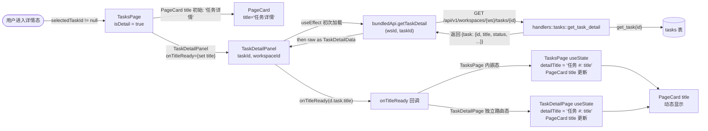
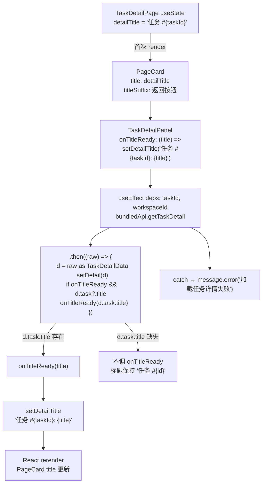

# 动态详情标题

## 功能位置

任务（详情） → `PageCard` 标题区，`TaskDetailPanel` 拉取任务详情后通过 `onTitleReady` 回调动态更新标题为「任务 #<id>: <title>」

## 数据流图（前端 → 后端）



## 调用关系链路图



## 数据结构图

```mermaid
classDiagram
  class TaskDetailPanelProps {
    +taskId: number
    +workspaceId: number
    +onTitleReady?: (title: string) => void
    +onTriggered?: () => void
    +onOpenTodo?: (todoId: number) => void
    +onLoopChanged?: () => void
  }
  class TaskDetailData {
    +task: {id, title, status, description?, workspace_id?, loop_id?}
    +template?: {display_name?, version?, complexity?}
    +steps: StepInfo[]
    +executions: ExecInfo[]
    +loop?: {id, workspace_id?}
  }
  class TaskDetailPage_State {
    +detailTitle: string
    +setDetailTitle: function
  }
  TaskDetailPanelProps --> TaskDetailData : 拉取后注入
  TaskDetailData --> TaskDetailPage_State : onTitleReady(d.task.title)
  note for TaskDetailPage_State "初始值: '任务 #{taskId}'\n回调后: '任务 #{taskId}: {title}'"
```

## 数据变更图

```mermaid
stateDiagram-v2
  [*] --> 加载中: 进入详情态
  加载中 --> 标题就绪: getTaskDetail 成功 且 d.task.title 存在
  加载中 --> 标题占位: getTaskDetail 成功 但 title 缺失
  加载中 --> 标题占位: getTaskDetail 失败（保持初始 '任务 #id'）
  note right of 加载中: PageCard title = '任务 #id'\nSpin loading态
  note right of 标题就绪: onTitleReady(title) 触发\nsetDetailTitle('任务 #id: title')\nPageCard title 动态更新
  note right of 标题占位: 不调 onTitleReady\n标题保持 '任务 #id'
  标题就绪 --> [*]: PageCard 显示完整标题
  标题占位 --> [*]: 标题保持占位
```

## 开发指导

- **前端入口**：`frontend/src/components/tasks/TaskDetailPage.tsx` 的 `TaskDetailPage`（`useState` `detailTitle` 初始 `'任务 #${taskId}'`，`TaskDetailPanel` 的 `onTitleReady={(title) => setDetailTitle(`任务 #${taskId}: ${title}`)}`）；`TaskDetailPanel` 在 `useEffect` 内 `bundledApi.getTaskDetail` `.then` 后调 `onTitleReady(d.task.title)`
- **后端入口**：`backend/src/handlers/tasks.rs` 的 `get_task_detail`（路由 `GET /api/v1/workspaces/{ws}/tasks/{id}`），返回 `{task: {id, title, status, workspace_id, loop_id}, template, loop, steps, executions}`
- **注意**：标题初始值是 `'任务 #{taskId}'`（只有 id），API 成功且有 `d.task.title` 时才回调更新为 `'任务 #{taskId}: ${title}'`；`onTitleReady` 判定 `d.task?.title` 存在才调（空标题不回调，保持占位）；`getTaskDetail` 失败时 `message.error` 并保持初始标题，不回调；`TasksPage` 内嵌态的 `PageCard` title 固定为 `'任务详情'`（不动态更新），动态标题只在 `TaskDetailPage` 独立路由态生效
- **扩展**：若需标题显示更多元信息（如状态），在 `onTitleReady` 签名改为 `(task: {id, title, status}) => void`，`TaskDetailPanel` 传完整 `task` 对象；后端 `get_task_detail` 返回的 `task` 字段已包含 `status`
