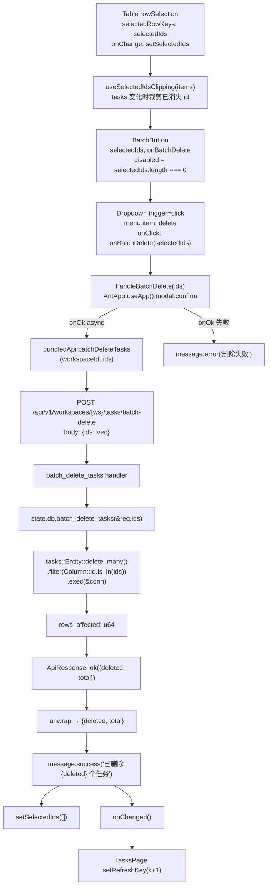
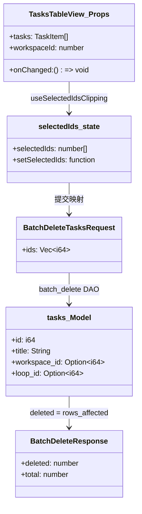
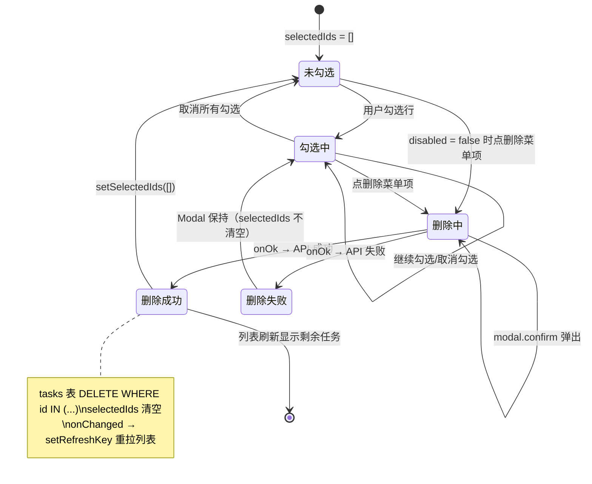

# 批量删除任务

## 功能位置

任务（列表） → 列表态视图 `TasksTableView` 内置 toolbar「批量」`Dropdown` 按钮 → 菜单项「删除」→ `modal.confirm` 确认窗

## 数据流图（前端 → 后端）

```mermaid
flowchart LR
  U([用户勾选多行]) -->|"Table rowSelection<br/>selectedRowKeys"| table["TasksTableView"]
  table -->|"useSelectedIdsClipping<br/>tasks 变化时移除已消失的行"| selected["selectedIds: number[]"]
  table -->|"BatchButton<br/>空选时 disabled"| batch_btn["批量 Dropdown"]
  U2([用户点删除菜单项]) -->|"onBatchDelete(selectedIds)"| confirm["modal.confirm<br/>'确认删除 N 个任务？'"]
  confirm -->|"onOk async"| api["bundledApi.batchDeleteTasks<br/>(workspaceId, ids)"]
  api -->|"POST /api/v1/workspaces/{ws}/tasks/batch-delete<br/>body: {ids: number[]}"]| route["handlers::tasks::batch_delete_tasks"]
  route -->|"db.batch_delete_tasks(&req.ids)"| db["db::task::batch_delete_tasks"]
  db -->|"DELETE FROM tasks<br/>WHERE id IN (...)"| tasks_tbl[(tasks 表)]
  db -->|"返回 rows_affected: u64"| route
  route -->|"返回 {deleted, total}"| api
  api -->|"unwrap result.deleted"| table
  table -->|"message.success<br/>'已删除 N 个任务'"| msg([用户])
  table -->|"setSelectedIds([]<br/>清空选中"]| cleared["selectedIds 清空"]
  table -->|"onChanged()"| page["TasksPage"]
  page -->|"setRefreshKey(k+1)"| reload["reload() 重拉列表"]
```

## 调用关系链路图



## 数据结构图



## 数据变更图



## 开发指导

- **前端入口**：`frontend/src/components/tasks/TasksTableView.tsx` 的 `handleBatchDelete`（`AntApp.useApp().modal.confirm` 确认 → `bundledApi.batchDeleteTasks`），`BatchButton` 组件控制空选禁用，`useSelectedIdsClipping` hook 维护选中态并在 `tasks` 变化时裁剪已消失 id
- **后端入口**：`backend/src/handlers/tasks.rs` 的 `batch_delete_tasks`（路由 `POST /api/v1/workspaces/{ws}/tasks/batch-delete`，`task_routes()` 注册）；DAO 层 `backend/src/db/task.rs` 的 `batch_delete_tasks`（`tasks::Entity::delete_many().filter(Column::Id.is_in(ids))`）
- **注意**：`batch_delete_tasks` DAO 在 `ids` 为空时直接返回 `Ok(0)`，不执行 SQL；返回的 `deleted` 是 `rows_affected`（`u64`），可能与 `ids.len()` 不同（部分 id 不存在时）；`handleBatchDelete` 使用 `AntApp.useApp().modal` 而非 `Modal.confirm` 静态方法，确保确认窗随当前主题 token 渲染；删除成功后必须调 `onChanged()` 触发父级 `TasksPage` 的 `setRefreshKey` 重拉列表，否则表格仍显示已删除任务
- **扩展**：新增其他批量操作（如批量暂停）时在 `BatchButton` 的 `Dropdown` menu `items` 加新项，对应 handler 仿照 `handleBatchDelete` 模式；后端新增批量 API 在 `task_routes()` 加路由，DAO 仿照 `batch_delete_tasks` 用 `delete_many`/`update_many` + `Column::Id.is_in`
