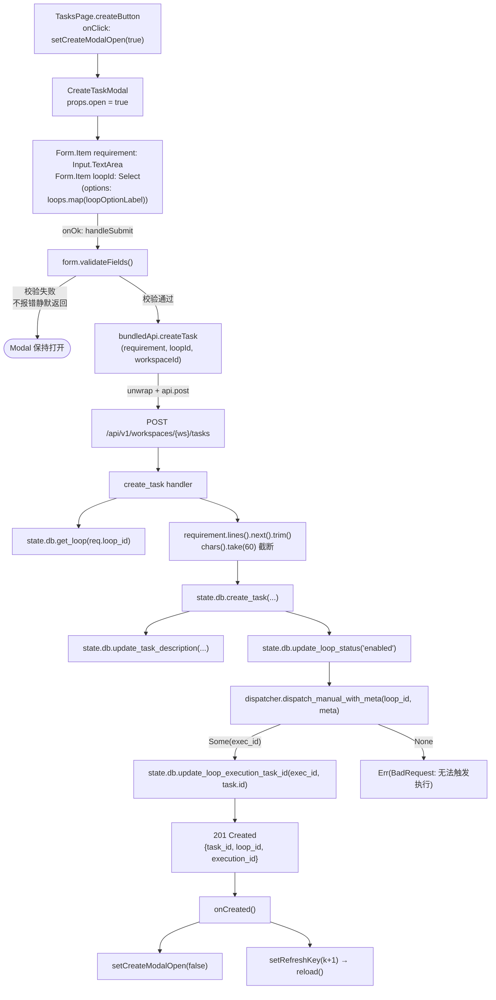
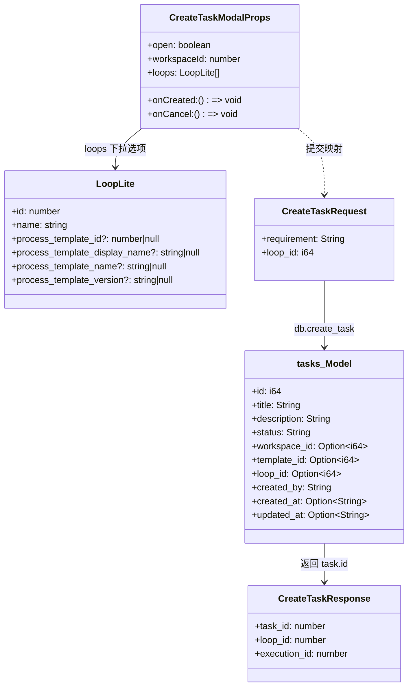
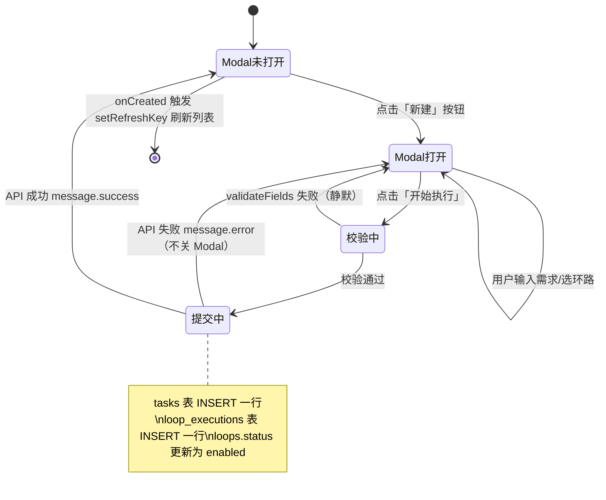

# 新建任务

## 功能位置

任务（列表） → 顶栏「新建」按钮 → `CreateTaskModal` 弹窗 → 表单提交「开始执行」

## 数据流图（前端 → 后端）

```mermaid
flowchart LR
  U([用户点「新建」]) -->|"setCreateModalOpen(true)"| page["TasksPage"]
  page -->|"loops: LoopLite[]<br/>已过滤 process_template_id 非空"| modal["CreateTaskModal<br/>(open, workspaceId, loops)"]
  modal -->|"用户填 requirement<br/>选 loopId"| form["antd Form.validateFields"]
  form -->|"校验 required + min:4"| submit["handleSubmit"]
  submit -->|"bundledApi.createTask<br/>(requirement, loopId, wsId)"| api["POST /api/v1/workspaces/{ws}/tasks<br/>body: {requirement, loop_id}"]
  api -->|"create_task"| handler["handlers::tasks::create_task"]
  handler -->|"get_loop(loop_id)"| loop_db["db::loop_::get_loop"]
  handler -->|"db.create_task(title, wsId, template_id, loop_id)"| db_create["db::task::create_task"]
  db_create -->|"INSERT INTO tasks<br/>(title, workspace_id, template_id, loop_id<br/>created_at, updated_at)"| tasks_tbl[(tasks 表)]
  handler -->|"update_task_description<br/>写全文 requirement"| db_update["db::task::update_task_description"]
  handler -->|"update_loop_status('enabled')"| loop_status["db::loop_::update_loop_status"]
  handler -->|"dispatcher.dispatch_manual_with_meta<br/>(loop_id, {requirement, source})"| dispatcher["LoopTriggerDispatcher"]
  dispatcher -->|"触发执行"| loop_exec[(loop_executions 表)]
  handler -->|"update_loop_execution_task_id<br/>(exec_id, task.id)"| loop_exec
  handler -->|"返回 {task_id, loop_id, execution_id}"| api
  api -->|"unwrap"| submit
  submit -->|"message.success<br/>'任务已创建，执行 #exec_id'"| modal
  modal -->|"onCreated"| page
  page -->|"setCreateModalOpen(false)<br/>setRefreshKey(k+1)"| page
```

## 调用关系链路图

## 数据结构图

## 数据变更图

## 开发指导

- **前端入口**：`frontend/src/components/tasks/CreateTaskModal.tsx` 的 `CreateTaskModal` 组件，由 `TasksPage` 的 `createButton`（`onClick={() => setCreateModalOpen(true)}`）触发；提交逻辑在 `handleSubmit`，调用 `bundledApi.createTask`（`frontend/src/api/bundled.ts` 的 `createTask` 方法）
- **后端入口**：`backend/src/handlers/tasks.rs` 的 `create_task`（路由 `POST /api/v1/workspaces/{ws}/tasks`，`task_routes()` 注册）；DAO 层 `backend/src/db/task.rs` 的 `create_task` + `update_task_description`
- **注意**：需求文本只写入 `tasks.description` 全文，标题取首行按**字符**截断到 60 字符（`chars().take(60)` 避免多字节 CJK 截 panic）；需求**绝不**写入 step todo 的 prompt（会随执行次数累加污染模板），改由 `trigger_meta.requirement` 在运行时注入 LoopRunner；`loops` 下拉只列 `process_template_id` 非空的环路（无工艺模板的环路无法创建任务）；`CreateTaskModal` 在 `open` 变 false 时 `form.resetFields`，避免下次打开残留上次输入
- **扩展**：新增表单字段时在 `CreateTaskModal` 的 `Form` 内加 `Form.Item`，同步在 `handleSubmit` 的 `validateFields` 返回类型中扩展；后端在 `CreateTaskRequest` 加字段，`create_task` handler 内调用对应 `db.update_task_*` 方法写入；若需要新字段独立更新方法，在 `backend/src/db/task.rs` 仿照 `update_task_description` 模式新增 `update_task_<field>`
