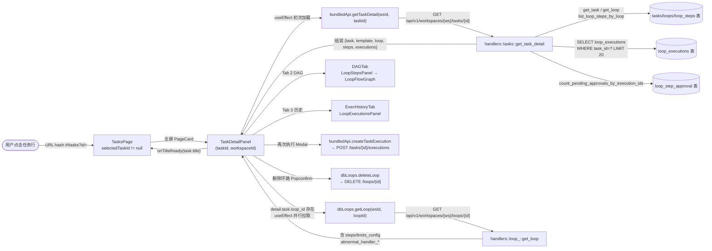

# 任务（详情）

> 页面级总览。本页各功能点的 4 图 + 开发指导在子文档中维护。

## 页面简介

任务详情态由 URL hash `#/tasks?id=<id>` 驱动：`TasksPage` 读到非 null 的 `selectedTaskId` 即进入详情全屏态，
渲染 `PageCard`（标题「任务详情」+ titleSuffix 返回按钮）内嵌 `TaskDetailPanel`。
`TaskDetailPanel` 合并了环路详情全部内容（任务与环路是 1:1 关系，`task.loop_id → loop.id`），通过三个 Tab 呈现：
- Tab 1 概览：任务描述 + 环路基本信息（工作空间/待审批）+ 全局限制 + 最新执行进度
- Tab 2 执行环路：来源工艺面包屑 + SVG DAG 流程图（复用 `LoopStepsPanel` → `LoopFlowGraph`）+ 步骤验收标准列表
- Tab 3 执行历史：复用 `LoopExecutionsPanel` 分页执行列表 + `TokenSummaryBar` + `StepExecList` + `BlackboardDrawer`

数据获取分两步：先 `bundledApi.getTaskDetail(wsId, taskId)` 拉任务详情（含基本 loop 信息、steps、executions 列表），
拿到 `task.loop_id` 后并行 `dbLoops.getLoop(wsId, loopId)` 拉完整 `LoopDetail`（含 steps、limits_config 等）。
顶部 `DetailHeader` 提供「再次执行」（弹 Modal 输入新需求 → `createTaskExecution`）和「删除环路」（`Popconfirm` → `dbLoops.deleteLoop`）两个操作。
任务标题加载完成后通过 `onTitleReady` 回调让外层 `PageCard` 动态更新标题为「任务 #<id>: <title>」。
DAG 流程图节点上的事项标题可点击，通过 `onOpenTodo(todoId)` 跳转 legacy todo 详情。

## 页面级数据流总图

## 功能点索引

- [返回列表](#/help/tasks-detail/task-detail-back)
- [动态详情标题](#/help/tasks-detail/task-detail-title)
- [查看任务 DAG / 执行历史](#/help/tasks-detail/task-detail-dag)
- [DAG 节点跳转事项](#/help/tasks-detail/task-detail-open-todo)
