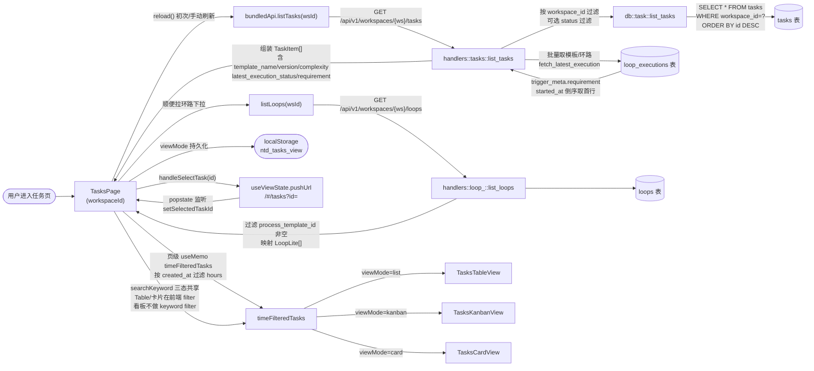

# 任务（列表）

> 页面级总览。本页各功能点的 4 图 + 开发指导在子文档中维护。

## 页面简介

任务列表页（`TasksPage`）是「任务」命名空间的列表态入口，由顶栏 `PageCard` 全屏挂载。
顶栏从左到右摆放：搜索框（`searchKeyword`，三态共享）→ 时间窗分段（`hours`，`showAll` 形态，`null` = 不过滤）→ 刷新按钮 → 视图切换 `Segmented`（列表/看板/卡片）→ 新建按钮。
三态视图共享同一份任务数据（`tasks`，由 `reload` 拉取全量），时间过滤与搜索过滤在页级 `useMemo` 统一完成，三态视图 props 零改动即可复用。
视图模式持久化到 `localStorage`（键 `ntd_tasks_view`），时间窗不持久化（管理视角默认收窄会让老任务消失）。
点击任务行通过 `useViewState.pushUrl('tasks', { id })` 写入 URL hash `#/tasks?id=<id>`，SPA 内同步 `setSelectedTaskId` 立即进入详情态全屏。
浏览器前进/后退监听 `popstate`，从 URL hash 同步 `selectedTaskId`，保证路由与组件态一致。
工作空间切换时若处于详情态会自动退出回到列表态（详情 id 属于旧工作空间，继续停留无意义）。

## 页面级数据流总图

