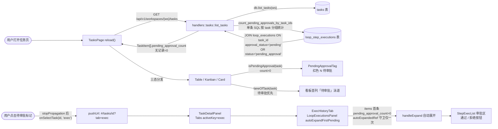
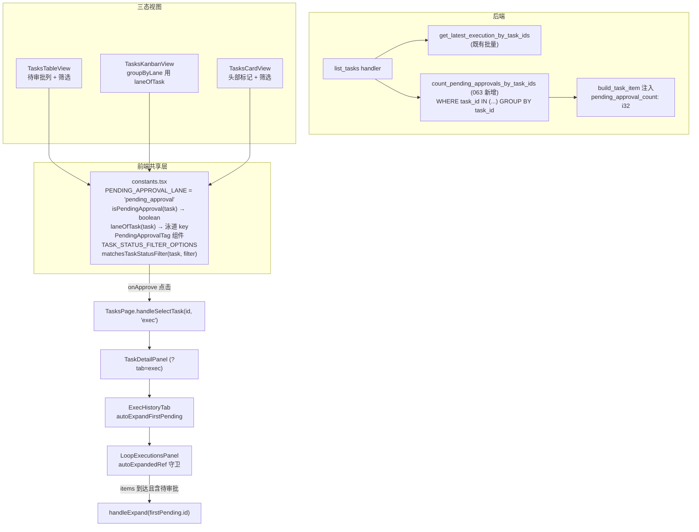
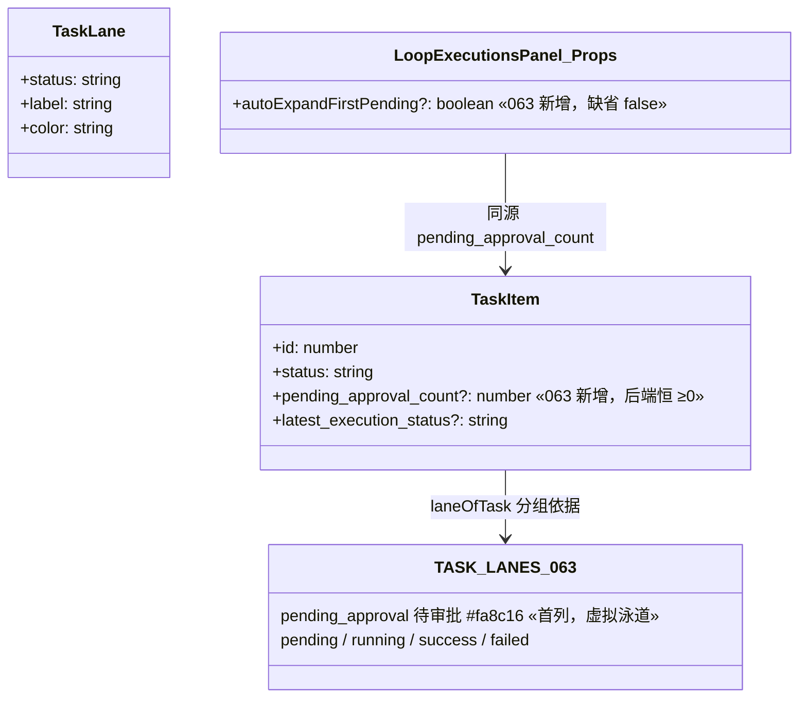
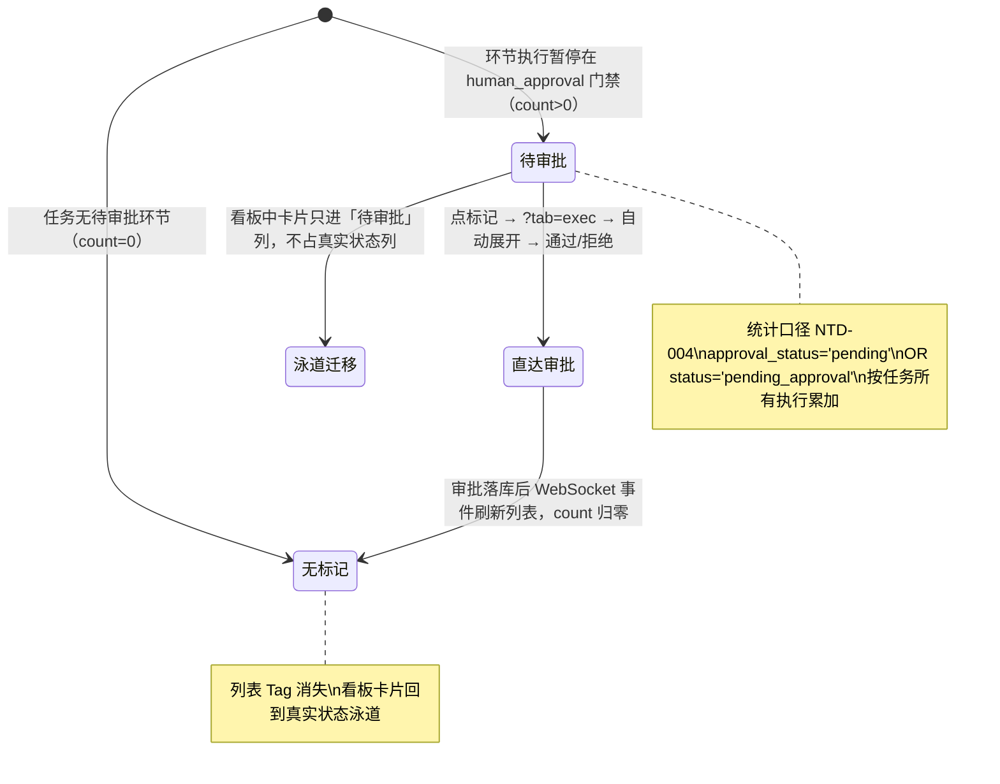

# 待审批透出与直达审批

## 功能位置

任务（列表） → 三态视图各有入口：
- **列表态**：独立「待审批」列（可排序），有待审批的任务显示红色「⚠ N 待审批」标记
- **看板态**：首列「待审批」泳道（橙色列头），`pending_approval_count > 0` 的任务卡片只进该列
- **卡片态**：卡片头部状态 Tag 旁的红色「N 待审批」标记

点击任一标记 → 跳转 `#/tasks/<id>?tab=exec` → 详情「执行历史」Tab 自动展开首条待审批执行 → 环节卡片内「通过 / 拒绝」按钮直接可见。

## 数据流图（前端 → 后端）

## 调用关系链路图

## 数据结构图

## 数据变更图

## 开发指导

- **前端入口**：共享层集中在 `frontend/src/components/tasks/constants.tsx`——`PENDING_APPROVAL_LANE`（虚拟泳道/筛选项键）、`isPendingApproval`、`laneOfTask`（待审批优先于真实 status）、`PendingApprovalTag`（红色标记，可点击）、`TASK_STATUS_FILTER_OPTIONS` + `matchesTaskStatusFilter`（列表/卡片筛选唯一事实源）。三态视图只消费不各自实现。
- **后端入口**：`backend/src/handlers/tasks.rs::list_tasks` 在既有批量查询后追加 `db.count_pending_approvals_by_task_ids(&task_ids)`（`backend/src/db/loop_.rs`），单条 `GROUP BY task_id` SQL 零 N+1；`build_task_item` 注入字段。
- **直达链路**：`PendingApprovalTag.onApprove` → `TasksPage.handleSelectTask(id, 'exec')` → URL `?tab=exec`（`TaskDetailPanel` 既有 tab 白名单机制）→ `ExecHistoryTab` 给 `LoopExecutionsPanel` 传 `autoExpandFirstPending` + `key={loopId}`（切任务强制 remount，守卫 ref 不残留）→ 面板内 `autoExpandedRef` 保证自动展开仅首屏触发一次。
- **注意**：统计口径与 NTD-004 一致（`approval_status='pending' OR status='pending_approval'`，两条暂停路径互斥不重复计数）；计数范围是该任务**所有执行**而非最近一次——旧执行滞留的审批不被新执行掩盖；待审批任务在看板只进一个泳道，各列计数之和恒等于任务总数；自动展开只在执行列表第一页内查找（分页 5 条），不在首页时行内红色标记仍可手动展开。
- **扩展**：新增视图形态时消费共享层即可获得待审批能力；若未来任务状态落库（真实 `pending_review` 枚举），只需改后端统计与 `laneOfTask`/`isPendingApproval` 两处判定，视图层零改动。
