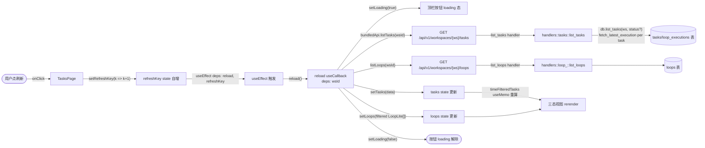
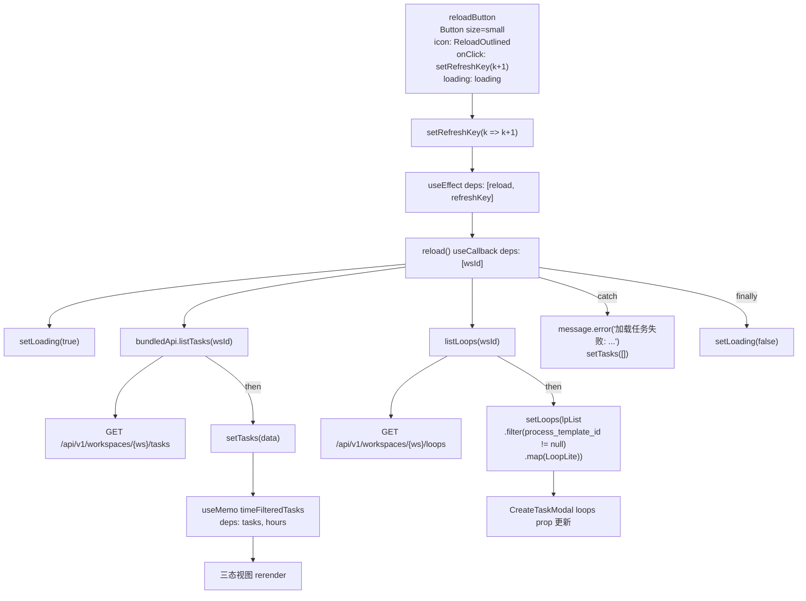
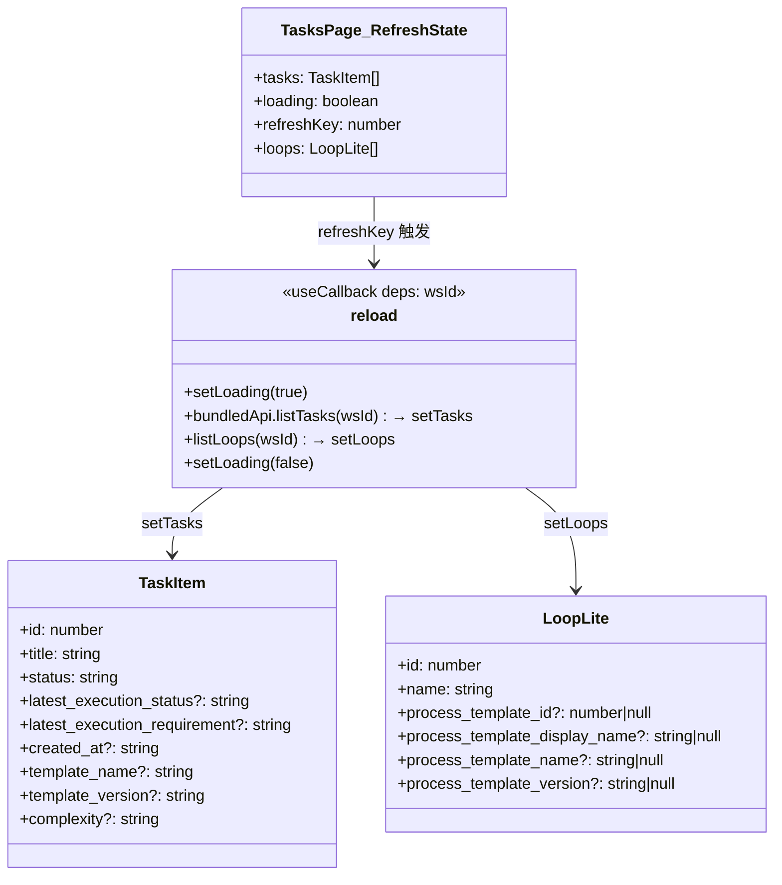
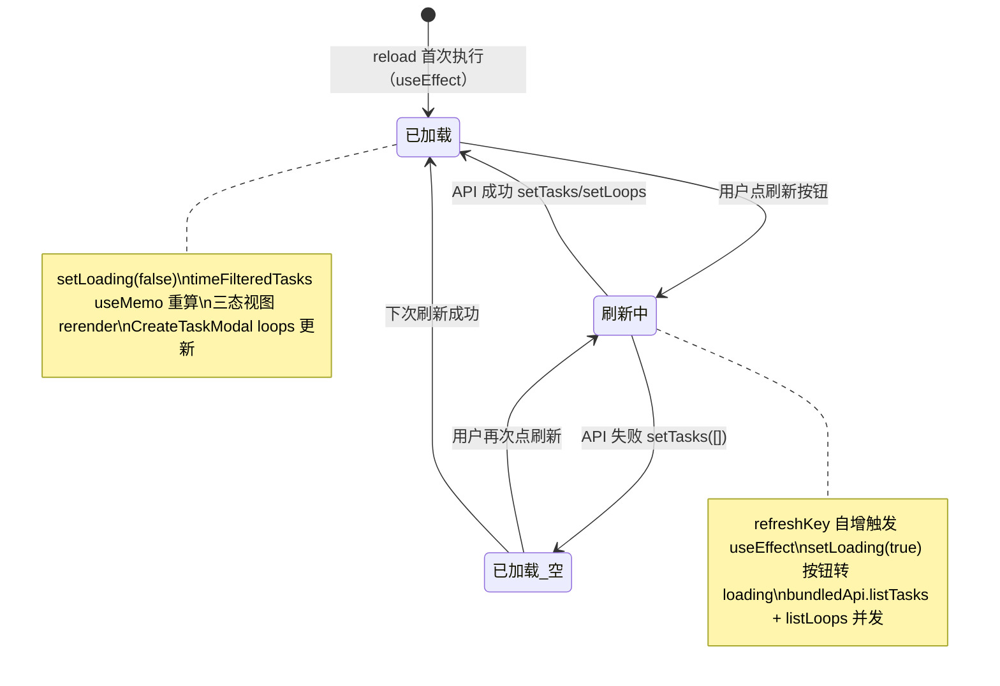

# 刷新

## 功能位置

任务（列表） → 顶栏「刷新」按钮（`ReloadOutlined` + loading 态）

## 数据流图（前端 → 后端）

## 调用关系链路图

## 数据结构图

## 数据变更图

## 开发指导

- **前端入口**：`frontend/src/components/tasks/TasksPage.tsx` 的 `reloadButton` 常量（`Button` + `onClick` → `setRefreshKey(k => k+1)`），`reload` `useCallback`（deps `[wsId]`）内并发 `bundledApi.listTasks` 和 `listLoops`；`useEffect` deps `[reload, refreshKey]` 监听刷新
- **后端入口**：`backend/src/handlers/tasks.rs` 的 `list_tasks`（路由 `GET /api/v1/workspaces/{ws}/tasks`）；`backend/src/handlers/loop_.rs` 的 `list_loops`（路由 `GET /api/v1/workspaces/{ws}/loops`）；DAO 层 `backend/src/db/task.rs` 的 `list_tasks`（按 `workspace_id` 过滤 + 可选 `status`，`ORDER BY id DESC`）
- **注意**：`reload` 不依赖 `loading`/`tasks`，避免 `reload` 自身变化触发循环；`refreshKey` 自增是触发刷新的唯一机制（新建任务回调 `handleCreated`、批量删除回调 `onChanged`、再次执行回调 `onTriggered` 都走 `setRefreshKey`）；`reload` 内 `listLoops` 返回的 `LoopListItem` 被裁成 `LoopLite`（只保留 id/name/工艺来源字段），并过滤 `process_template_id` 非空（只有带工艺模板的环路才能创建任务）；API 失败时 `setTasks([])` 清空列表防止残留旧数据
- **扩展**：若需轮询自动刷新，新增 `useEffect` with `setInterval` 调 `setRefreshKey(k => k+1)`，卸载时 `clearInterval`；若需刷新时保留筛选状态，`searchKeyword`/`hours`/`viewMode` 不在 `reload` 内重置，刷新后筛选 useMemo 自动重算
