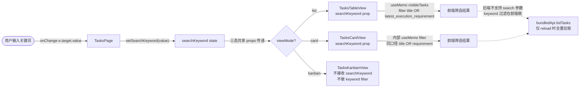
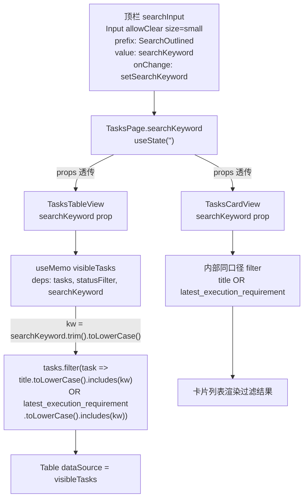
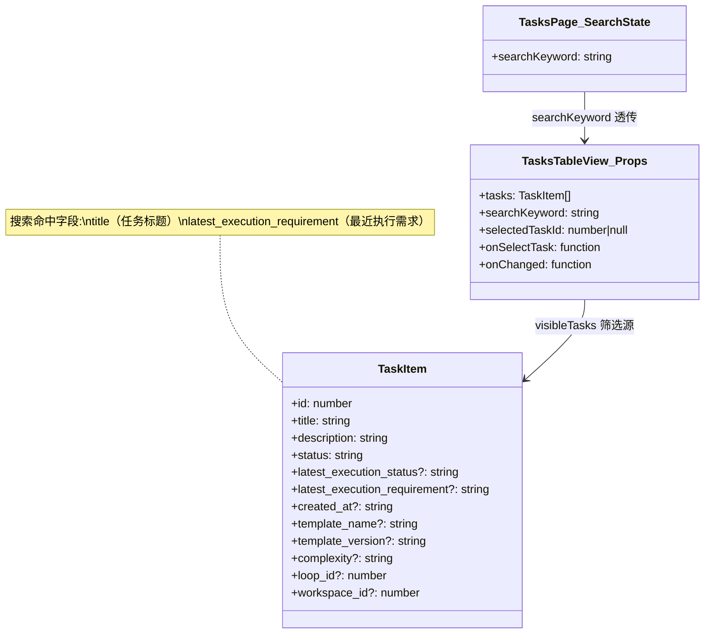

# 搜索任务

## 功能位置

任务（列表） → 顶栏搜索框 `Input`（`SearchOutlined` 前缀，placeholder「搜索任务标题或需求」）

## 数据流图（前端 → 后端）



## 调用关系链路图



## 数据结构图



## 数据变更图

```mermaid
stateDiagram-v2
  [*] --> 无关键词: searchKeyword = ''
  无关键词 --> 关键词输入中: 用户 onChange
  关键词输入中 --> 关键词输入中: 持续输入
  关键词输入中 --> 无关键词: allowClear 清空 / 全删
  note right of 关键词输入中: 筛选口径: trim().toLowerCase()\n命中 title 或 latest_execution_requirement\nstatus 筛选叠加生效（Table 视图）
  note right of 无关键词: 三态视图显示全量 tasks\n不传 keyword 给后端
```

## 开发指导

- **前端入口**：`frontend/src/components/tasks/TasksPage.tsx` 的 `searchInput` 常量（`Input` + `onChange` → `setSearchKeyword`），`searchKeyword` state 三态视图共享；列表态筛选在 `frontend/src/components/tasks/TasksTableView.tsx` 的 `visibleTasks` `useMemo`，卡片段在 `TasksCardView` 内部同口径 filter
- **后端入口**：无后端调用。后端 `list_tasks` 目前不支持 `search` 参数，关键词过滤完全在前端做（`bundledApi.listTasks` 全量拉取后前端 filter）
- **注意**：搜索口径是 `title` OR `latest_execution_requirement`（两个字段都 `toLowerCase().includes(kw)`，`kw` 已 `trim().toLowerCase()`）；看板态（`TasksKanbanView`）不接收 `searchKeyword`，不做关键词过滤（设计如此）；`searchKeyword` 不持久化，页面刷新后清空
- **扩展**：若后端未来支持 `search` 参数，在 `bundledApi.listTasks` 签名加可选 `search` 参数，`reload` 内透传 `searchKeyword`，前端 filter 可移除改为后端筛选；新增可搜索字段时同步修改 `TasksTableView` 的 `visibleTasks` 和 `TasksCardView` 的 filter 逻辑
