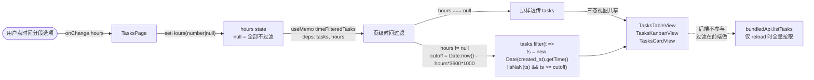
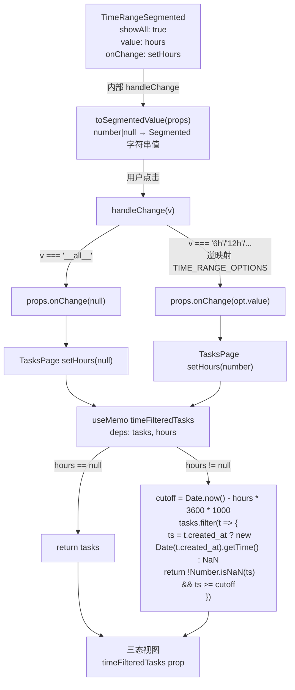
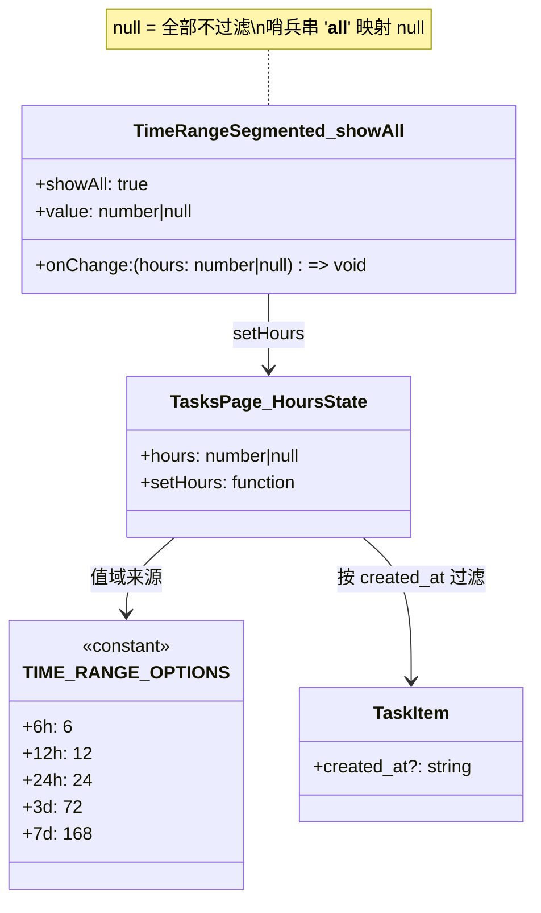
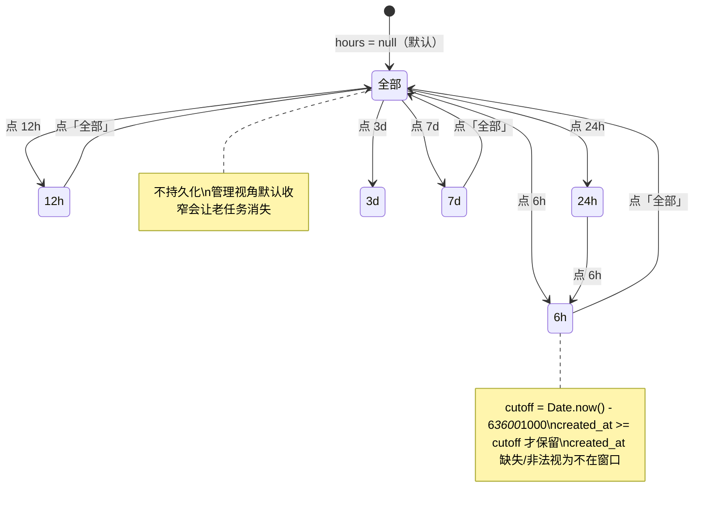

# 时间窗过滤

## 功能位置

任务（列表） → 顶栏时间分段 `TimeRangeSegmented`（`showAll` 形态，首项「全部」+ 6h/12h/24h/3d/7d）

## 数据流图（前端 → 后端）

## 调用关系链路图

## 数据结构图

## 数据变更图

## 开发指导

- **前端入口**：`frontend/src/components/tasks/TasksPage.tsx` 的 `timeRangeSegment` 常量（`TimeRangeSegmented` `showAll` 形态），`hours` state 默认 `null`（全部不过滤），页级过滤在 `timeFilteredTasks` `useMemo`；时间分段组件定义在 `frontend/src/components/common/TimeRangeSegmented.tsx`，选项集 `TIME_RANGE_OPTIONS` 全站唯一事实源
- **后端入口**：无后端调用。时间过滤完全在前端做，后端 `list_tasks` 不支持时间参数
- **注意**：`hours` 不持久化（与看板页 `hours` 不持久化现状一致，需求 031 结论 2C）；`created_at` 缺失或非法时 `new Date().getTime()` 返回 `NaN`，filter 中 `!Number.isNaN(ts)` 判定将其排除（与 KanbanBoard 对非法时间 NaN-drop 处理对齐）；过滤放在页级而非各视图内，与 `searchKeyword` 的共享方式一致，三态视图 props 零改动
- **扩展**：新增时间选项只改 `frontend/src/components/common/TimeRangeSegmented.tsx` 的 `TIME_RANGE_OPTIONS` 一处，所有使用页面（任务页/看板页）同步生效；若需后端时间过滤，在 `list_tasks` DAO 加 `created_at >= cutoff` 条件，前端 `reload` 透传 `hours`
