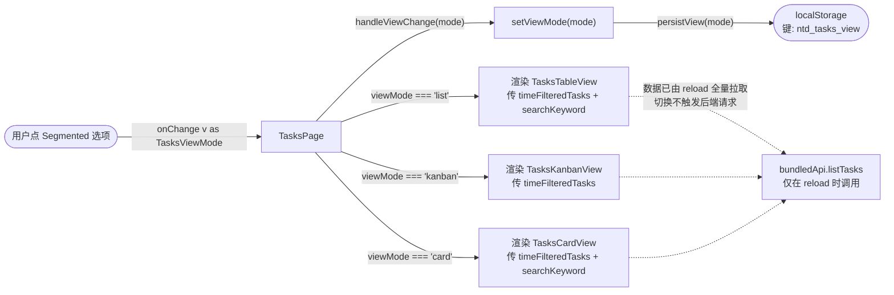
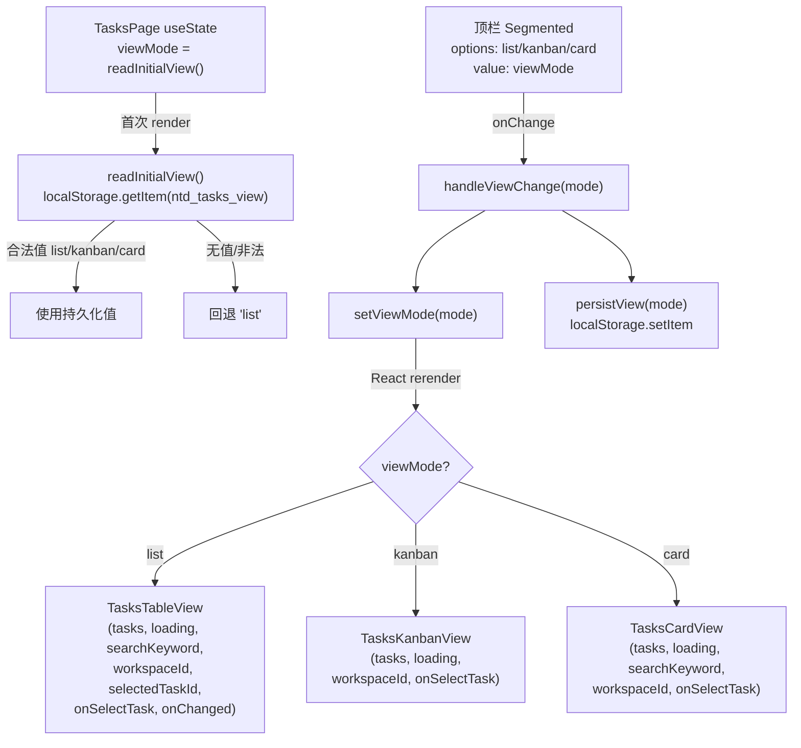
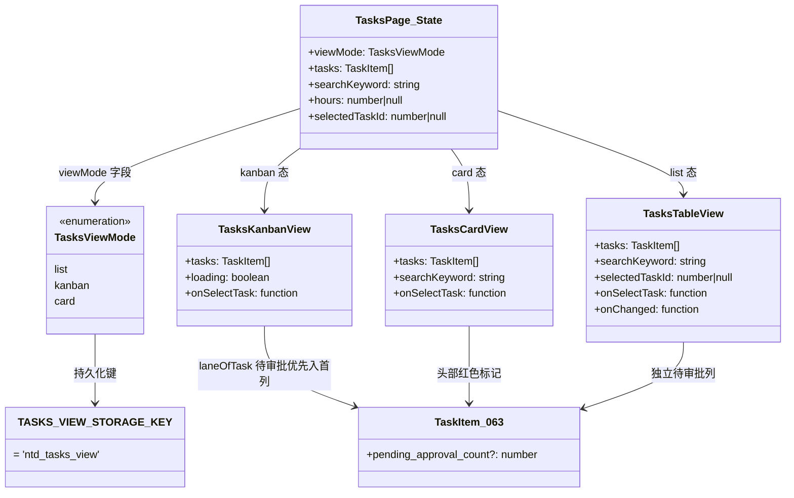
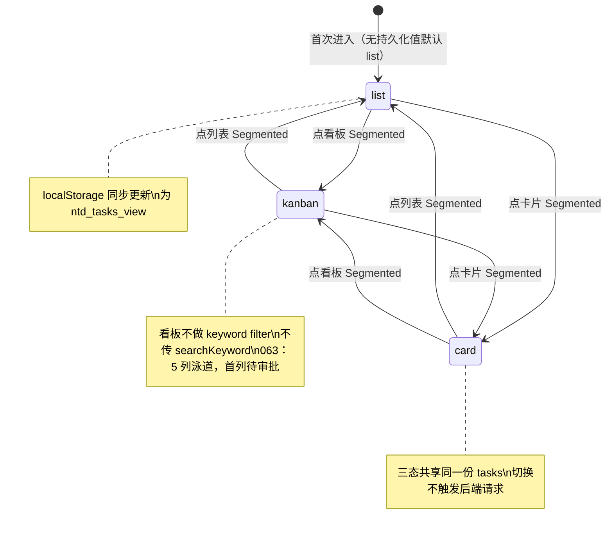

# 视图切换（列表/看板/卡片）

## 功能位置

任务（列表） → 顶栏 `Segmented` 视图切换控件（列表 `UnorderedListOutlined` / 看板 `AppstoreOutlined` / 卡片 `LayoutOutlined`）

> 063 起三态视图的待审批透出差异：**看板**为 5 列泳道（首列「待审批」虚拟泳道，`pending_approval_count > 0` 的任务只进该列）；**列表**为独立「待审批」可排序列；**卡片**为头部红色「N 待审批」标记。列表/卡片的状态筛选下拉均含「待审批」虚拟项（筛选项与过滤谓词收口在 `constants.tsx` 的 `TASK_STATUS_FILTER_OPTIONS` + `matchesTaskStatusFilter`，两视图共享唯一事实源）。

## 数据流图（前端 → 后端）

## 调用关系链路图

## 数据结构图

## 数据变更图

## 开发指导

- **前端入口**：`frontend/src/components/tasks/TasksPage.tsx` 的 `TasksPage` 组件；视图切换在 `handleViewChange`（`setViewMode` + `persistView`），`Segmented` 控件定义在 `viewSwitch` 常量；持久化键 `TASKS_VIEW_STORAGE_KEY`（值 `ntd_tasks_view`）定义在 `frontend/src/components/tasks/constants.tsx`
- **后端入口**：无后端调用。视图切换是纯前端态，数据由 `reload`（`bundledApi.listTasks`）在页级全量拉取，三态视图共享同一份 `timeFilteredTasks`
- **注意**：`readInitialView` 只接受 `list`/`kanban`/`card` 三个字面量，`localStorage` 不可用时静默降级回 `'list'`；看板态（`TasksKanbanView`）不接收 `searchKeyword`，不做关键词过滤（设计如此，与需求 031 结论一致）；时间过滤和搜索过滤在页级 `useMemo` 完成，三态视图 props 零改动即可复用过滤结果
- **扩展**：新增第四种视图模式时在 `TasksViewMode` 联合类型加值，`Segmented` 的 `options` 加对应项，`TasksPage` 渲染分发 `if (viewMode === 'xxx')` 分支加新视图组件；`readInitialView` 的合法值白名单同步加新值
