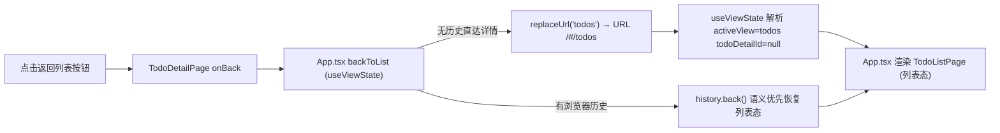
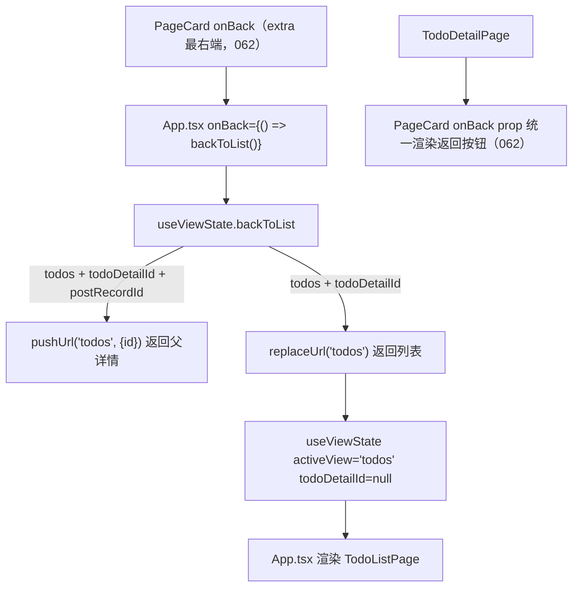
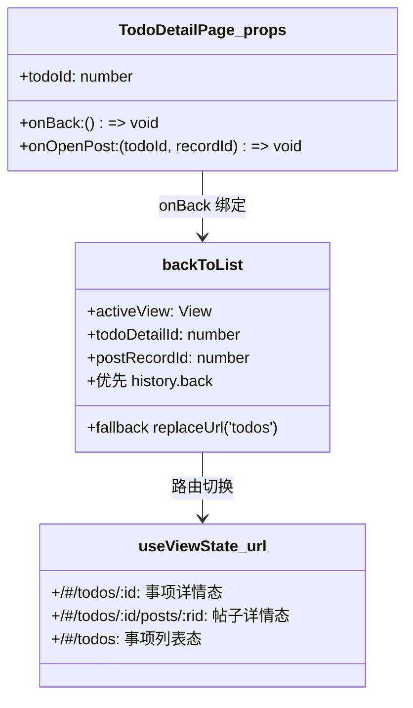
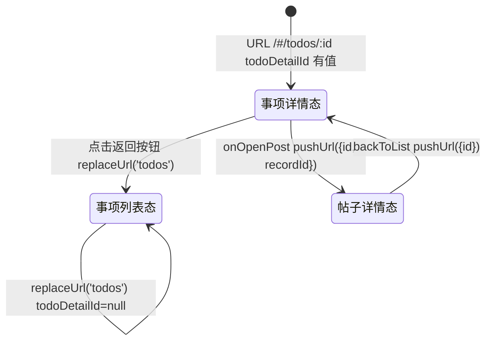

# 返回列表

## 功能位置

事项详情页 → `PageCard` 页头 extra 区最右端的「返回列表」按钮（`ArrowLeftOutlined`）。062 起统一走 `PageCard` 的 `onBack` prop（固定右上角锡点），各详情页不再手写 `titleSuffix` 按钮。

## 数据流图（前端 → 后端）

## 调用关系链路图

## 数据结构图

## 数据变更图

## 开发指导

- **前端入口**：`frontend/src/components/TodoDetailPage.tsx` 的 `TodoDetailPage`（062 起将 `onBack` 传给 `PageCard` 的 `onBack` prop，按钮统一渲染在 extra 区最右端）；`onBack` 由 `frontend/src/App.tsx` 绑定为 `() => backToList()`；实现在 `frontend/src/hooks/useViewState.ts` 的 `backToList`。
- **后端入口**：无。返回列表纯前端路由切换，不调后端。
- **注意**：`backToList` 按 URL 层级 fallback：帖子页 → 父事项详情、事项详情 → 列表。062 起返回按钮与其他操作按钮同处 extra 区且固定最右端（统一样式与位置，不再紧贴标题）。返回后 `TodoListPage` 的 `viewMode` / `searchKeyword` 由各自组件 state 管理，浏览器 history后退可保留列表状态；直接 `replaceUrl` 进入则重置。
- **扩展**：若需返回时传参（如指定选中事项 id），改 `onBack` 为携带参数的回调，在 `backToList` 后 `pushUrl('todos', {selectId})` 并让 `TodoListPage` 读取 query 初始化选中。
