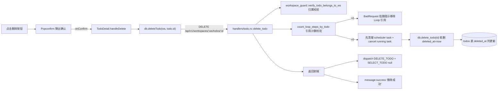
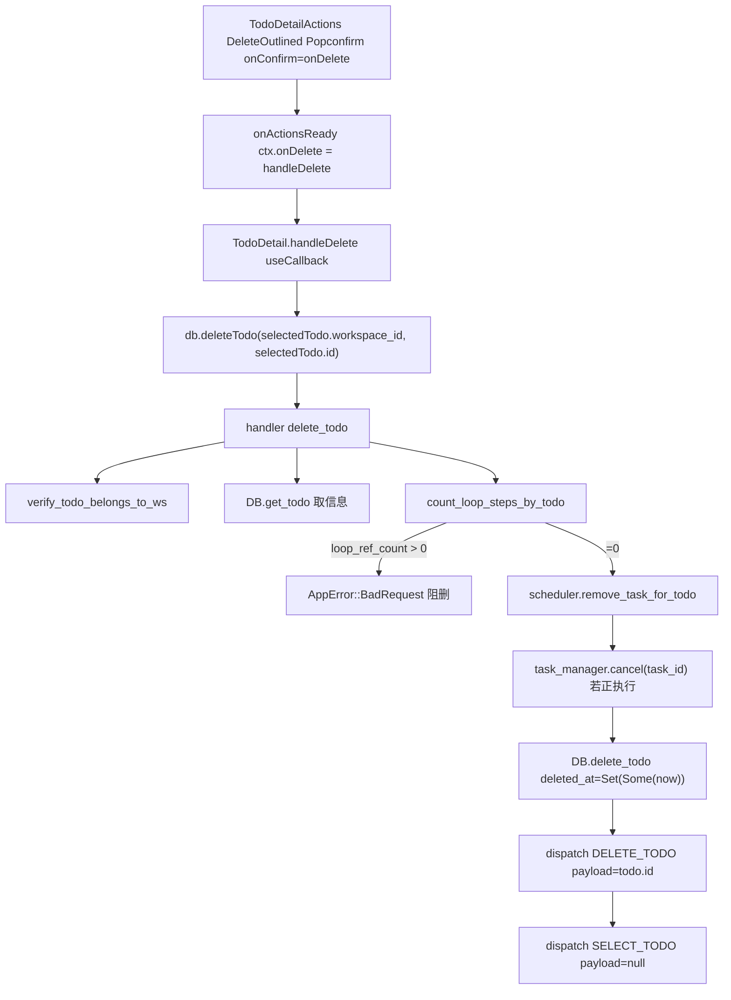
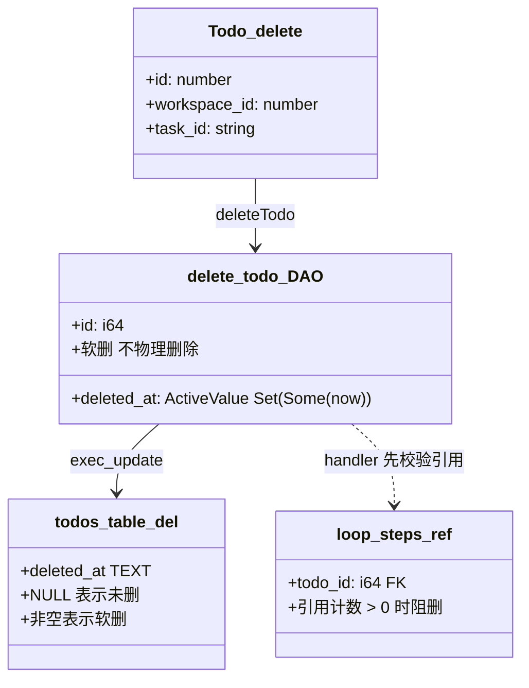
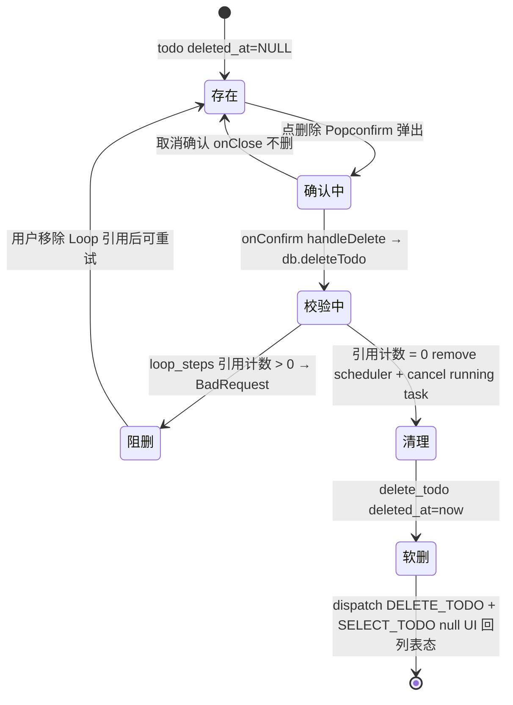

# 删除事项

## 功能位置

事项详情页 → `PageCard` 右上角 `extra` 操作按钮组的「删除」按钮（`DeleteOutlined`，`Popconfirm` 二次确认 `title="删除任务" description="确定要删除吗？"`，`type="text"`，`className="icon-btn"`，`aria-label="删除任务"`）。

## 数据流图（前端 → 后端）

## 调用关系链路图

## 数据结构图

## 数据变更图

## 开发指导

- **前端入口**：`frontend/src/components/todo-detail/TodoDetailActions.tsx` 的 `TodoDetailActions`（删除 `Popconfirm` + `Button`，L64-66）；回调链在 `frontend/src/components/TodoDetail.tsx` 的 `handleDelete`（L318-328），经 `onActionsReady` 上报给 `TodoDetailPage` 渲染到 `extra`。
- **后端入口**：`backend/src/handlers/todo.rs::delete_todo`（L399，DELETE `/api/v1/workspaces/:ws/todos/:id`），DAO 在 `backend/src/db/todo.rs::delete_todo`（L1060，软删 `deleted_at`）。
- **注意**：删除是破坏性操作，前端 `Popconfirm` 二次确认。后端删除前校验 `count_loop_steps_by_todo` 引用计数，被 Loop 环节引用的事项返回 BadRequest 不允许删（关注数据完整性，禁用环节也算引用）。删除前先 `scheduler.remove_task_for_todo` 清调度任务，若 todo 正在执行则 `task_manager.cancel(task_id)` 取消。DAO 是软删（`deleted_at=now`），不物理删除行，后续查询 `deleted_at IS NULL` 过滤。前端删除成功后 dispatch `DELETE_TODO` + `SELECT_TODO null`，UI 回列表态（详情页 selectedTodo 清空）。
- **扩展**：若需「恢复已删事项」，后端已有 `restore_todo` handler（POST `/api/v1/workspaces/:ws/todos/:id/archive` 的 restore 对偶），前端在列表增「已归档/已删」分区展示 deleted_at 非空项并提供恢复按钮即可。
