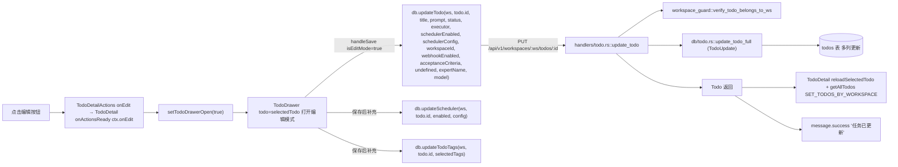
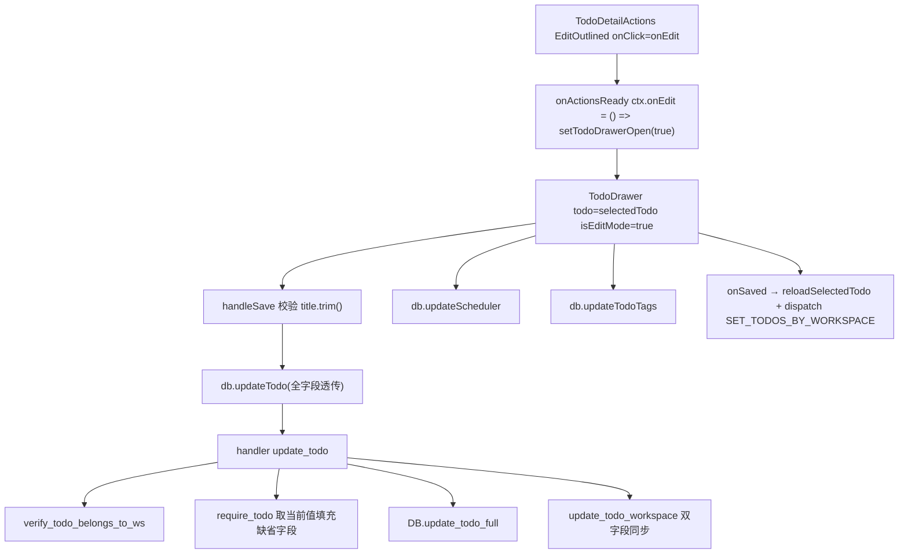
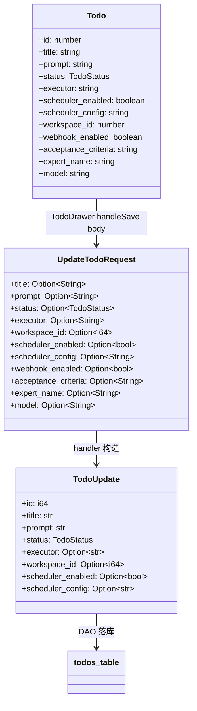
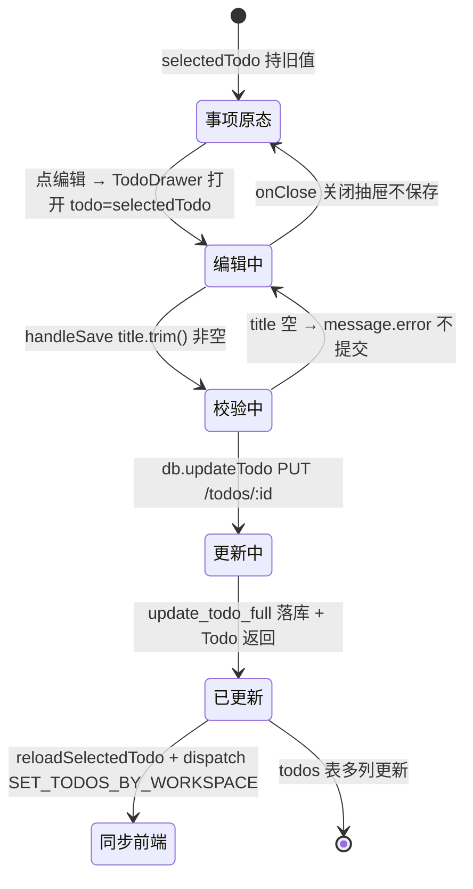

# 编辑事项

## 功能位置

事项详情页 → `PageCard` 右上角 `extra` 操作按钮组的「编辑」按钮（`EditOutlined`，`type="text"`，`className="icon-btn"`，`aria-label="编辑任务"`）。

## 数据流图（前端 → 后端）

## 调用关系链路图

## 数据结构图

## 数据变更图

## 开发指导

- **前端入口**：`frontend/src/components/todo-detail/TodoDetailActions.tsx` 的 `TodoDetailActions`（编辑 `Button`，L63）；回调链在 `frontend/src/components/TodoDetail.tsx` 的 `onActionsReady`（L333-345，`onEdit: () => setTodoDrawerOpen(true)`）与 `TodoDrawer` 渲染（L485-499）；`TodoDrawer` 编辑保存在 `frontend/src/components/TodoDrawer.tsx` 的 `handleSave`（L204-278，`isEditMode && todo` 分支 L222-238）。
- **后端入口**：`backend/src/handlers/todo.rs::update_todo`（L283，PUT `/api/v1/workspaces/:ws/todos/:id`），DAO 在 `backend/src/db/todo.rs::update_todo_full`（L511）。调度器补充更新走 `db.updateScheduler` → `backend/src/handlers/scheduler.rs`，标签走 `db.updateTodoTags` → `handlers/todo.rs::update_todo_tags`。
- **注意**：编辑入口由 `TodoDetail` 内部 `setTodoDrawerOpen(true)` 打开抽屉，`todo=selectedTodo` 让 `TodoDrawer` 走 `isEditMode=true` 分支。`handleSave` 先校验 `title.trim()` 非空，再 `db.updateTodo` 全字段透传（保持未改字段不变）。后端 `update_todo` handler 先 `verify_todo_belonds_to_ws` 归属校验，再 `require_todo` 取当前值填充请求中缺省字段（None 表示不改）。`model` 字段 `null → ''` 清除任务级模型，非空 → 设置。`onSaved` 用 `reloadSelectedTodo` 拉最新数据避免 local state 滞后，并 `getAllTodos` 同步 workspace 桶。
- **扩展**：新增可编辑字段（如 `review_enabled`）时，在 `TodoDrawer` 表单增控件 → `handleSave` 的 `db.updateTodo` 参数增字段 → `UpdateTodoRequest` / `TodoUpdate` 加字段 → `update_todo_full` DAO 写列 → `Todo` 响应同步。
