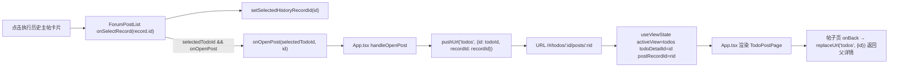
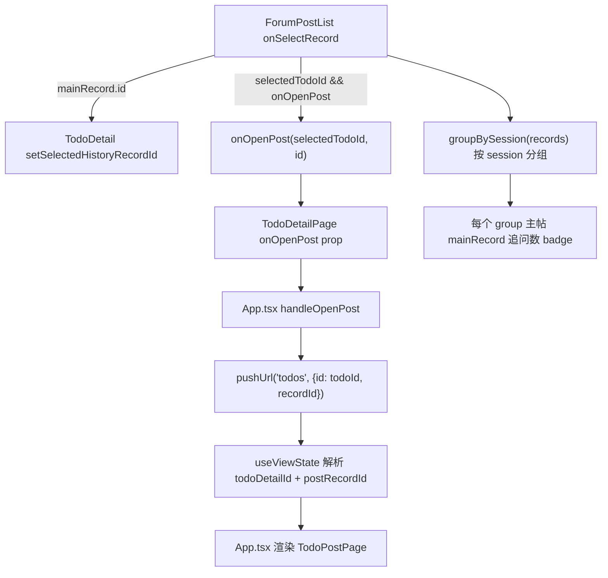
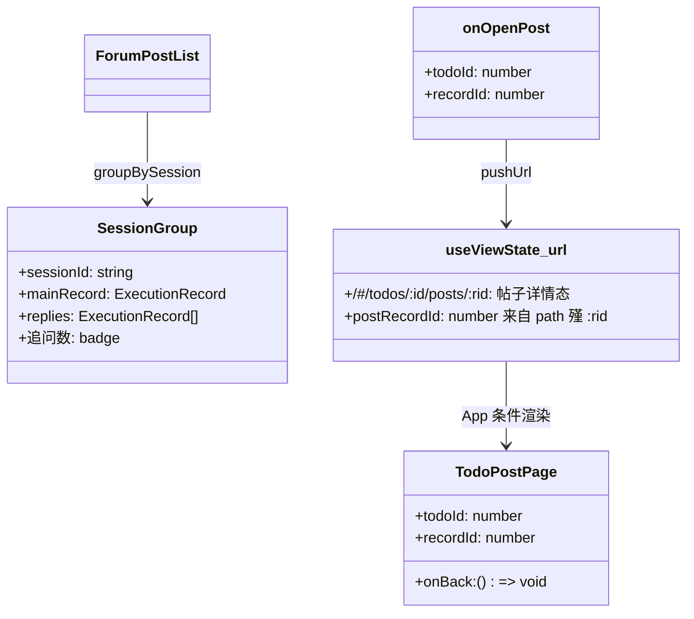
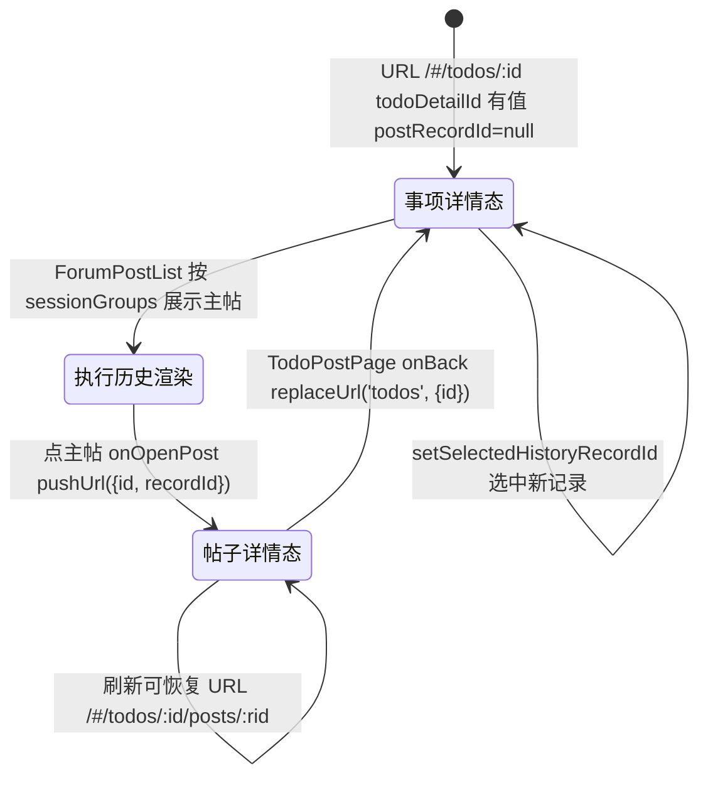

# 打开帖子/执行记录

## 功能位置

事项详情页 → 「执行历史」区块的 `ForumPostList` 主帖卡片（每个 session 的第一条记录，追问数量以 `badge` 展示），点击主帖触发 `onSelectRecord` → `onOpenPost`。

## 数据流图（前端 → 后端）

## 调用关系链路图

## 数据结构图

## 数据变更图

## 开发指导

- **前端入口**：`frontend/src/components/todo-detail/ForumPostList.tsx` 的 `ForumPostList`（`onSelectRecord` 触发，L9-40）；回调链在 `frontend/src/components/TodoDetail.tsx`（L466-480，`onSelectRecord` 内调 `setSelectedHistoryRecordId` + `onOpenPost`）→ `TodoDetailPage` prop `onOpenPost` → `frontend/src/App.tsx` 的 `handleOpenPost`（L187-190，`pushUrl('todos', {id, recordId})`）；路由解析在 `frontend/src/hooks/useViewState.ts`（`postRecordId` 来自 path 殣 `:rid`）；帖子页组件 `frontend/src/components/todo-post/TodoPostPage`。
- **后端入口**：无（打开帖子是纯前端路由切换）。帖子页内部数据由 `db.getExecutionRecord` / `db.getExecutionLogs` 拉取，后端在 `backend/src/handlers/execution.rs::get_execution_record`（L86）与 `get_execution_logs_handler`（L160）。
- **注意**：`ForumPostList` 只展示每个 session 的主帖（第一条记录），追问数量以 `badge` 展示，点击主帖进帖子页看完整帖子流。`onSelectRecord` 同时调 `setSelectedHistoryRecordId` 选中新记录（详情页内联选中态）与 `onOpenPost` 跳转帖子页。帖子页 URL 用 path 棡 `/#/todos/:id/posts/:rid`，刷新可恢复。帖子页 `onBack` 用 `replaceUrl('todos', {id})` 返回父事项详情（保留事项详情态）。
- **扩展**：若需「直接跳第 N 条追问」而非主帖，在 `onOpenPost` 传 `recordId` 为追问记录 id，`TodoPostPage` 据该 id 定位滚动即可；后端执行记录已按 id 单条查询支持。
