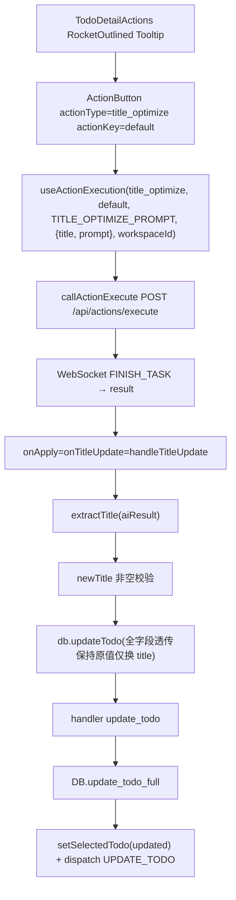
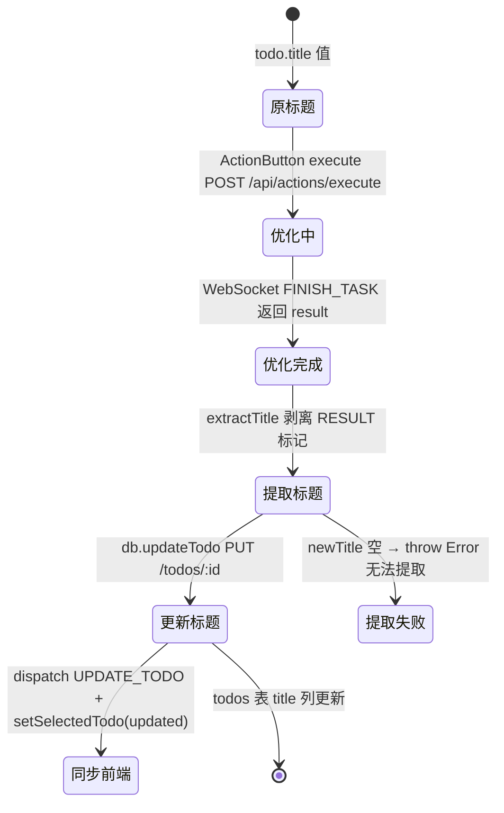

# 自动优化标题

## 功能位置

事项详情页 → `PageCard` 右上角 `extra` 操作按钮组的「自动优化标题」按钮（`RocketOutlined`，`ActionButton` + `Tooltip title="自动优化标题"`，`buttonType="text"`）。

## 数据流图（前端 → 后端）

```mermaid
flowchart LR
  U[点击自动优化标题按钮] --> AB["ActionButton 展开 prompt 编辑面板"]
  AB -->|params {title, prompt} 替换占位符| Exec["useActionExecution.execute"]
  Exec -->|POST /api/actions/execute| AEH["handlers/action.rs::execute_action"]
  AEH -->|按 action_type=title_optimize 查找模板 todo| DAO["db/todo.rs::get_todo_by_action_type_and_key"]
  AEH -->|注入 prompt 执行| WS["WebSocket FINISH_TASK 事件"]
  WS --> Result["ActionButton result 视图"]
  Result -->|onApply| handleTitleUpdate["TodoDetail.handleTitleUpdate"]
  handleTitleUpdate --> extract["extractTitle(aiResult) 剥离 RESULT 标记"]
  extract --> FE["db.updateTodo(ws, id, newTitle, prompt, status, executor, scheduler_enabled, scheduler_config, workspace_id, webhook_enabled, acceptance_criteria, auto_review_enabled)"]
  FE -->|PUT /api/v1/workspaces/:ws/todos/:id| H["handlers/todo.rs::update_todo"]
  H --> DAO2["db/todo.rs::update_todo_full (TodoUpdate)"]
  DAO2 --> T[(todos 表 title 更新)]
  H --> Resp["Todo 返回"]
  Resp --> dispatch["dispatch UPDATE_TODO + setSelectedTodo"]
```

## 调用关系链路图



## 数据结构图

```mermaid
classDiagram
class TITLE_OPTIMIZE_PROMPT {
  +模板: 你是标题优化专家
  +占位符: {{title}} {{prompt}}
  +输出: RESULT 标记包裹
}
class ExecuteActionResult {
  +task_id: String
  +record_id: i64
  +result: String
}
class TodoUpdate_title {
  +id: i64
  +title: newTitle
  +prompt: 原值透传
  +status: 原值透传
  +executor: 原值透传
}
class todos_table_title {
  +id INTEGER PK
  +title TEXT
  +action_type TEXT
  +action_key TEXT
}
TITLE_OPTIMIZE_PROMPT --> ExecuteActionResult : ActionButton 执行
ExecuteActionResult --> extractTitle : 剥离 RESULT
extractTitle --> TodoUpdate_title : newTitle
TodoUpdate_title --> todos_table_title : update_todo_full 落库
```

## 数据变更图



## 开发指导

- **前端入口**：`frontend/src/components/todo-detail/TodoDetailActions.tsx` 的 `TodoDetailActions`（`ActionButton` 渲染，`TITLE_OPTIMIZE_PROMPT` 常量 L8-22）；回调链在 `frontend/src/components/TodoDetail.tsx` 的 `handleTitleUpdate`（L289-313），经 `onActionsReady` 上报给 `TodoDetailPage` 渲染到 `extra`。
- **后端入口**：AI 执行 `backend/src/handlers/action.rs`（POST `/api/actions/execute`，按 `action_type=title_optimize` 查模板 todo）；标题落库 `backend/src/handlers/todo.rs::update_todo`（L283），DAO 在 `backend/src/db/todo.rs::update_todo_full`（L511）。
- **注意**：`TITLE_OPTIMIZE_PROMPT` 是独立常量避免多处口径漂移，输出要求用 `RESULT` 标记包裹最终标题。`handleTitleUpdate` 用 `extractTitle` 剥离标记取纯标题，空值 throw Error。`updateTodo` 透传全字段保持原值（仅换 title），避免优化标题时误清空 prompt/scheduler/webhook 等字段。`onTitleUpdate` 未注入时不渲染按钮（与原 DetailHeader 行为一致）。按钮上下文由 `TodoDetail` 通过 `onActionsReady` 回调上报，`hideTitleRow=true` 时按钮上提到外层 PageCard extra 不消失。
- **扩展**：新增「自动优化 Prompt」时，在 `TodoDetailActions` 增第二个 `ActionButton`（`actionType=prompt_optimize`）→ 写对应 prompt 模板 → 后端按 `action_type=prompt_optimize` 查模板 todo → `onApply` 回调用 `updateTodo` 更新 prompt 字段。
