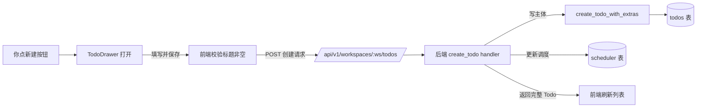
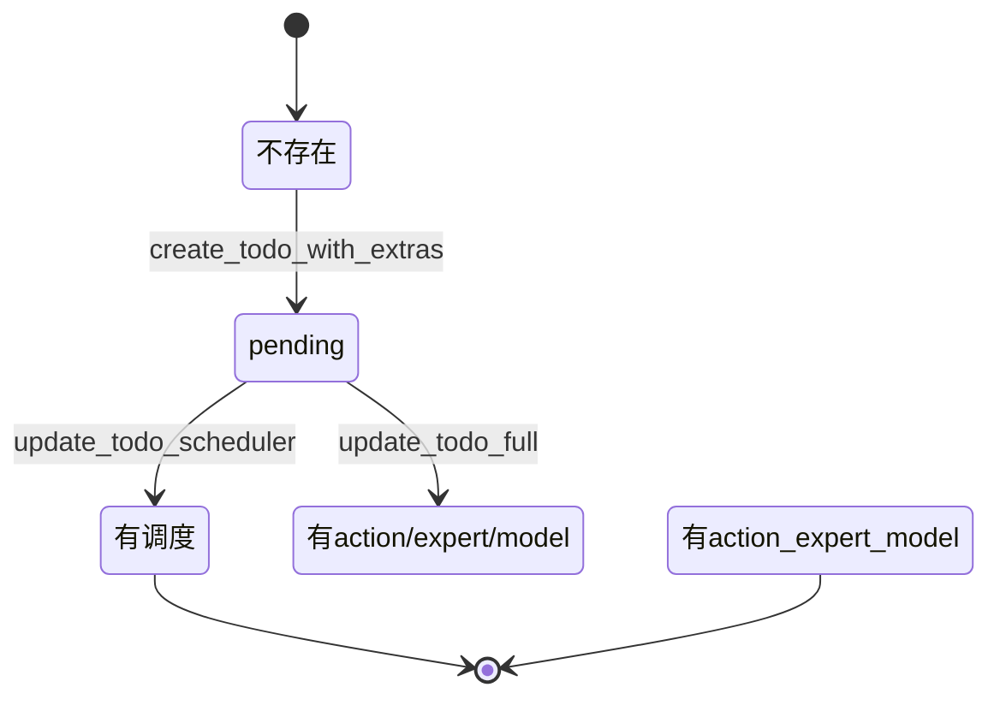

# 新建事项

事项列表页顶部「新建」主按钮（`PlusOutlined`）触发事项创建。

## 在这里做什么

- 创建一个新的事项（Todo），定义标题、提示词、执行器、调度等
- 创建后事项进入列表，可被立即执行或按调度自动触发

## 怎么操作

1. 点事项列表页顶部「新建」按钮，TodoDrawer 打开创建模式。
2. 填标题（必填，`trim()` 后非空）、提示词、选执行器、配置调度（可选）。
3. 点保存，`handleSave` 走 `db.createTodo`，POST 到后端。
4. 后端创建事项主体 + 更新调度器，返回完整 `Todo`。
5. 前端 dispatch 刷新列表，新事项出现在列表中。

## 操作后会发生什么

- 标题空串 / 全空白 → handler 返回 `BadRequest("Title is required")`，前端报错。
- `workspace_id` 必填，handler 按 id 反查 `workspaces` 拿 path，同步写入 `todos.workspace_id` + `workspace_path` 两列。
- `executor` 缺省时取 DB 默认执行器（`get_default_executor_name`）。
- 创建后若需补 `action_type` / `expert_name` / `model`，走 `update_todo_full`，因为 `create_todo_with_extras` 不支持这些字段。

## 事项创建数据流

## 事项状态流转

## 常见问题

**Q：为什么创建后还要单独 update 补 action_type/expert/model？**
A：`create_todo_with_extras` 不支持这三个字段，YAGNI 阶段先简化，后续如需可扩。

**Q：新增字段怎么扩展？**
A：`CreateTodoRequest` 加字段 → `create_todo` handler 取值 → `create_todo_with_extras` 或后续 `update_todo_full` 落库 → `Todo` 响应结构同步加字段。
