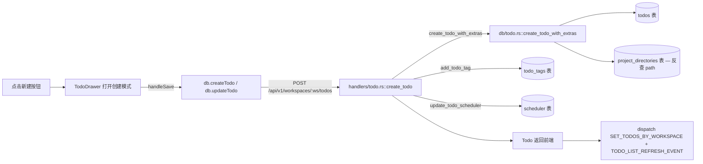
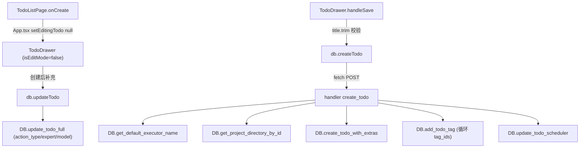
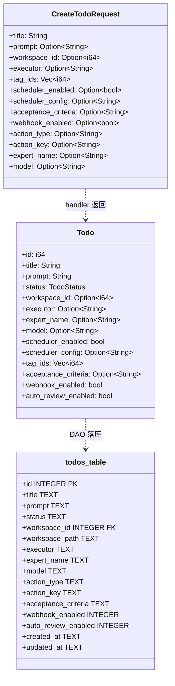
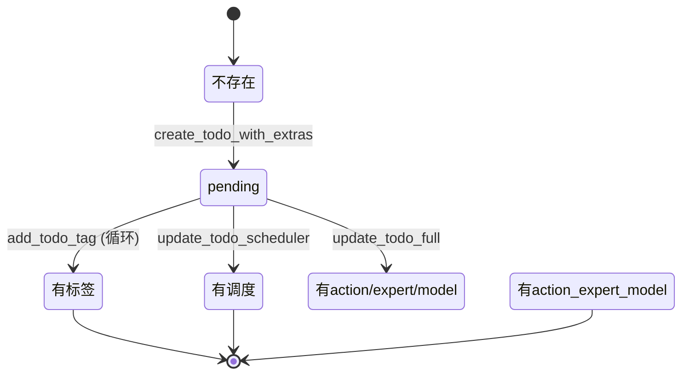

# 新建事项

## 功能位置

事项列表页 → 顶部 header「新建」主按钮（`PlusOutlined`）。

## 数据流图（前端 → 后端）

## 调用关系链路图

## 数据结构图

## 数据变更图

## 开发指导

- **前端入口**：`frontend/src/components/TodoDrawer.tsx` 的 `handleSave`（约 L204）。创建分支在 `isEditMode && todo` 为 false 的 else 块（L239-269）。
- **后端入口**：`backend/src/handlers/todo.rs::create_todo`（L116）。DAO 在 `backend/src/db/todo.rs::create_todo_with_extras`。
- **注意**：
  - `title.trim()` 必须非空，否则 handler 返回 `BadRequest("Title is required")`。
  - `workspace_id` 必填（L145-147），handler 按 id 反查 `project_directories` 拿 path，同步写入 `todos.workspace_id` + `workspace_path` 两列。
  - `executor` 缺省时取 DB 默认执行器（`get_default_executor_name`），handler 层只解析一次再下传 DAO。
  - 创建后若需补 `action_type`/`expert_name`/`model`，走 `update_todo_full`（handler L176-195），因为 `create_todo_with_extras` 不支持这些字段。
  - `tag_ids` 是创建后循环 `add_todo_tag` 写 `todo_tags` 关联表。
- **扩展**：新增字段时，在 `CreateTodoRequest` 加字段 → `create_todo` handler 取值 → `create_todo_with_extras` 或后续 `update_todo_full` 落库 → `Todo` 响应结构同步加字段。
