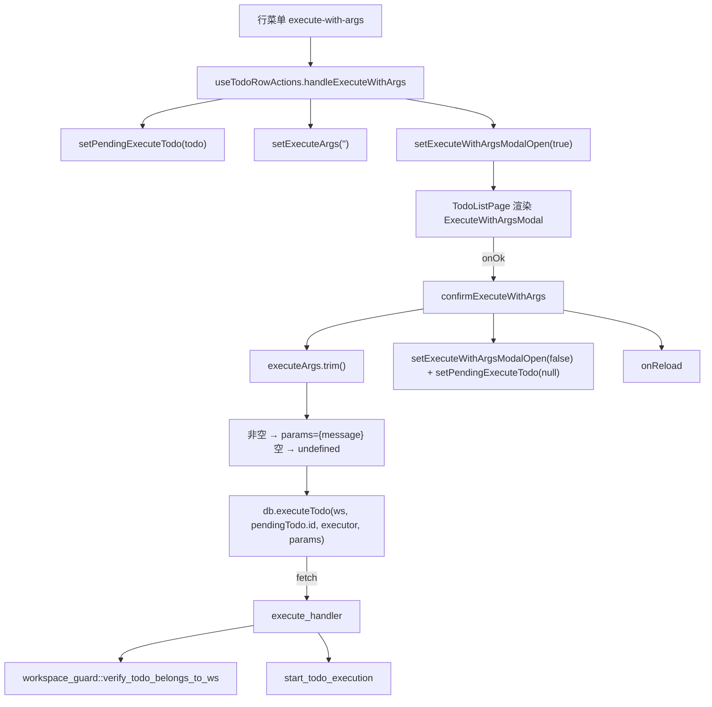
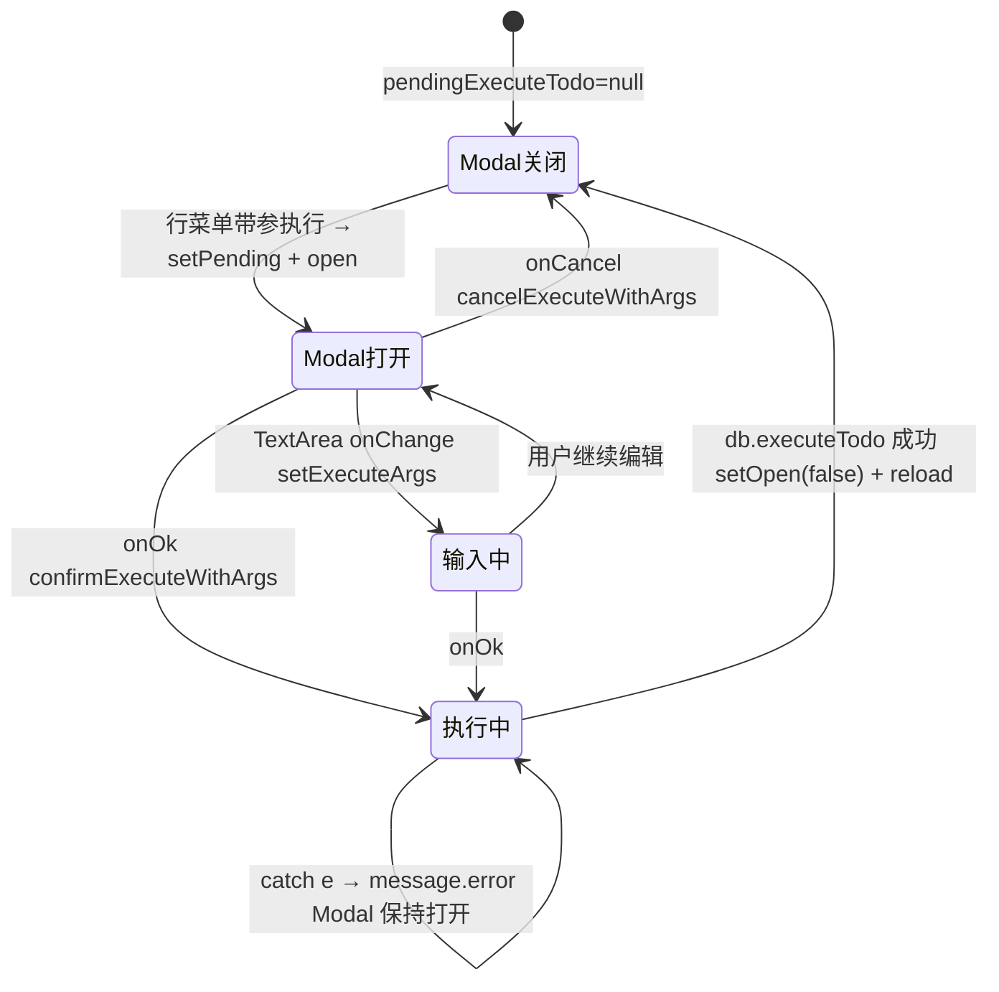

# 带参执行 Modal

## 功能位置

事项列表页 → 列表视图行菜单「带参执行」项触发 `ExecuteWithArgsModal`（`ThunderboltOutlined` + 标题「带参执行」 + `Input.TextArea` 输入补充信息）。

## 数据流图（前端 → 后端）

```mermaid
flowchart LR
  U[行菜单点带参执行] --> open["handleExecuteWithArgs: setPendingExecuteTodo + setExecuteArgs('') + Modal open"]
  open --> Modal["ExecuteWithArgsModal TextArea"]
  Modal -->|"onOk"| confirm["confirmExecuteWithArgs"]
  confirm --> params["params = executeArgs.trim() ? {message: trimmed} : undefined"]
  params --> FE["db.executeTodo(ws, pendingTodo.id, executor, params)"]
  FE -->|POST /api/v1/workspaces/:ws/executions| EH["handlers/execution.rs::execute_handler"]
  EH -->|"message 注入 {{message}} 占位符"| replace["replace_placeholders(todo.prompt, params)"]
  replace --> start["start_todo_execution (trigger_type=manual)"]
  start --> ER[(execution_records 表新建 running 记录)]
  start --> Resp["{task_id, record_id} 返回"]
  Resp --> reload["onReload 刷新列表 + message.success"]
  Modal -->|"onCancel"| cancel["cancelExecuteWithArgs: Modal close + setPendingExecuteTodo null"]
```



## 调用关系链路图



## 数据结构图

```mermaid
classDiagram
class ExecuteWithArgsModal_state {
  +open: boolean
  +args: string
  +pendingExecuteTodo: TodoCenterItem | null
}
class ExecuteRequest {
  +todo_id: i64
  +executor: Option~String~
  +params: Option~Record~String,String~
  +message: Option~String~
}
class params_construct {
  +空串: undefined
  +非空: {message: executeArgs.trim()}
}
class replace_placeholders {
  +input: todo.prompt
  +占位符: {{message}}
  +输出: 注入补充信息后的最终 message
}
ExecuteWithArgsModal_state --> params_construct : confirmExecuteWithArgs
params_construct --> ExecuteRequest : executeTodo body
ExecuteRequest --> replace_placeholders : handler 注入
```

## 数据变更图



## 开发指导

- **前端入口**：`frontend/src/components/todo-list/TodoListPageParts.tsx` 的 `ExecuteWithArgsModal`（L197-220，受控组件）与 `useTodoRowActions` 的 `confirmExecuteWithArgs`（L156-168）、`handleExecuteWithArgs`（L149-153）、`cancelExecuteWithArgs`（L171-174）；`TodoListPage` 在底部渲染该 Modal（L185-191）。
- **后端入口**：`backend/src/handlers/execution.rs::execute_handler`（L200），`message` 字段在 handler 内注入 `params.message`（若未已设置）后经 `replace_placeholders` 替换 `todo.prompt` 中的 `{{message}}` 占位符。
- **注意**：`params` 仅当 `executeArgs.trim()` 非空才构造 `{ message }`，空串传 `undefined` 表示无补充信息（与「立即执行」等价）。`destroyOnHidden` 让 Modal 关闭后卸载内部 TextArea state，避免下次打开残留上次输入。`pendingExecuteTodo.executor` 缺省时传 `undefined`，后端回退 todo 自带 executor。后端执行前校验 todo 归属 workspace 并检查并发上限 `max_concurrent_todos`。
- **扩展**：若需支持多个占位符（如 `{{branch}}`），在 Modal 增多个输入字段 → `params` 构造为 `{message, branch}` → 后端 `replace_placeholders` 已支持任意 `{{key}}` 替换。
