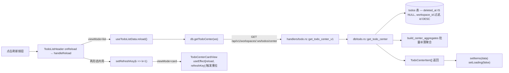
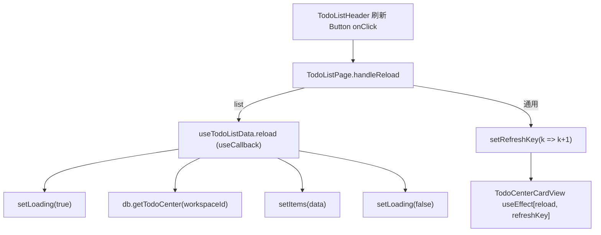
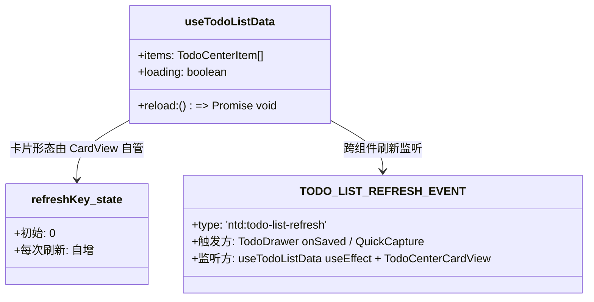
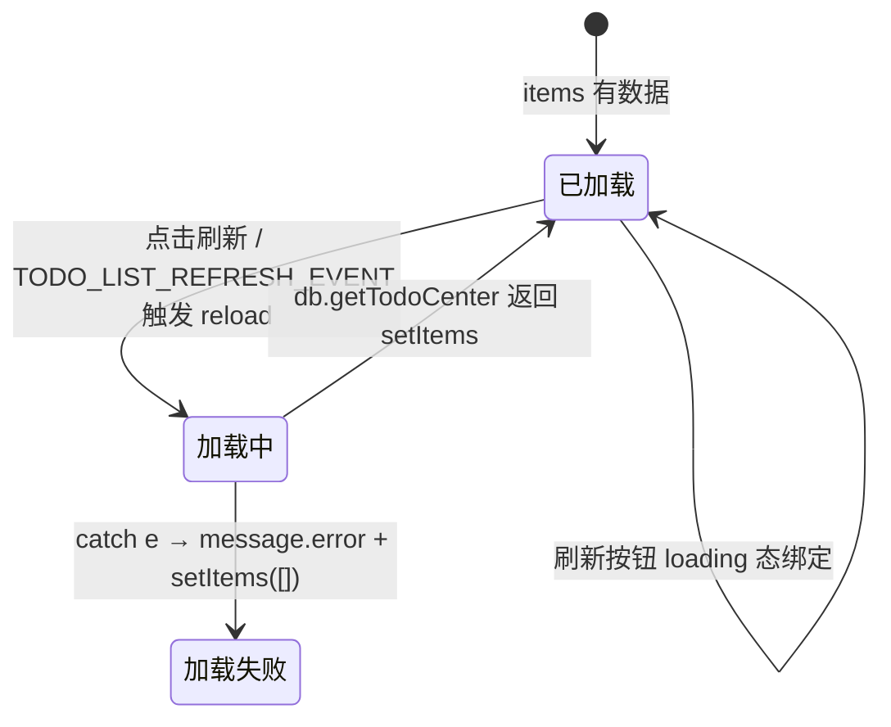

# 刷新列表

## 功能位置

事项列表页 → 顶部 header 的「刷新」`Button`（`ReloadOutlined`，`aria-label="刷新"`，`loading` 绑定数据加载态）。

## 数据流图（前端 → 后端）

## 调用关系链路图

## 数据结构图

## 数据变更图

## 开发指导

- **前端入口**：`frontend/src/components/todo-list/TodoListPage.tsx` 的 `handleReload`（L133-136）与 `useTodoListData`（L55-87，`reload` useCallback）；渲染在 `frontend/src/components/todo-list/TodoListPageParts.tsx` 的 `TodoListHeader`（刷新 Button，`loading` 绑定）。
- **后端入口**：`backend/src/handlers/todo.rs::get_todo_center_v1`（L676），DAO 在 `backend/src/db/todo.rs::get_todo_center`（L203）。
- **注意**：列表形态 `reload()` 调 `db.getTodoCenter`；卡片形态不走 `reload()`，靠 `refreshKey` 自增驱动 `TodoCenterCardView` 的 useEffect 重拉。`TODO_LIST_REFRESH_EVENT` custom event 是跨组件刷新通道（TodoDrawer 保存后 `window.dispatchEvent`），列表/卡片两种形态都监听该事件但仅在对应 `viewMode` 下触发，避免卡片形态误拉数据。
- **扩展**：新增「强制清缓存刷新」时，在 `reload` 前清空 `items` state 再拉取；若要给后端加时间戳参数（仅取增量），在 `db.getTodoCenter` 传 `since` 查询参数并让 `get_todo_center_v1` 支持。
