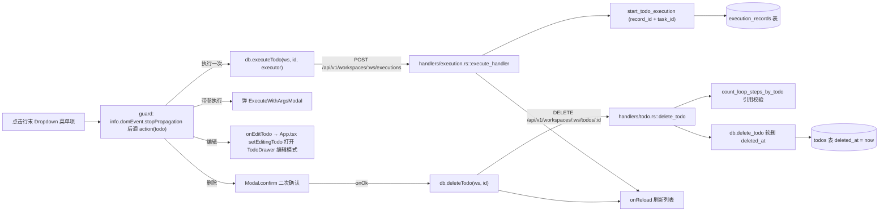
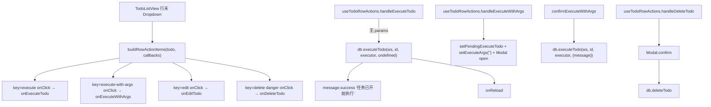
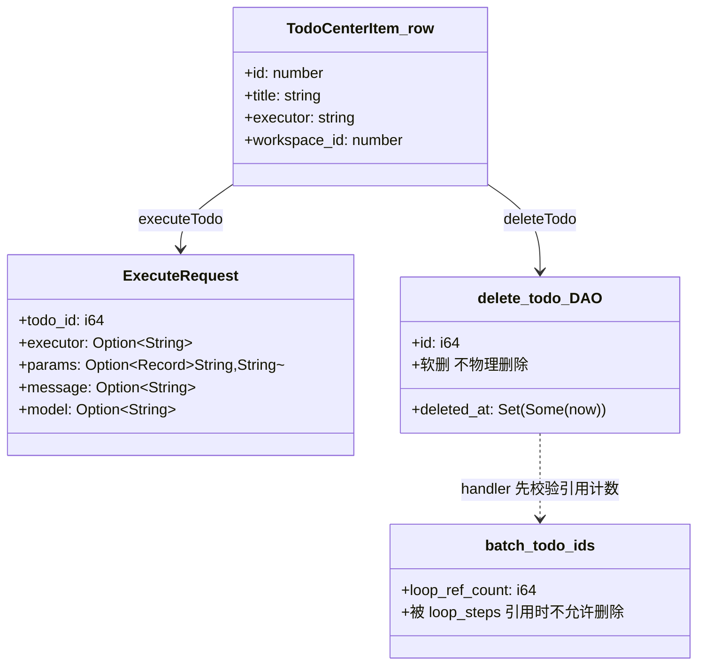
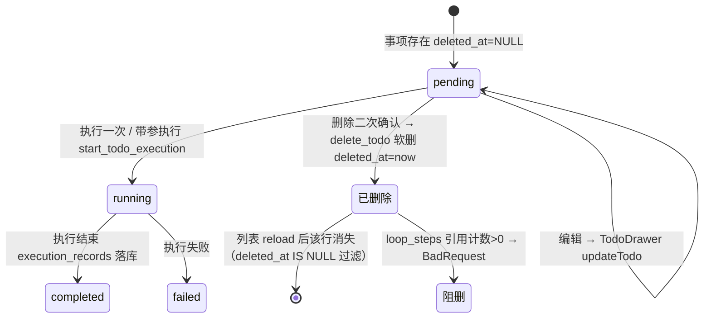

# 单行操作（删除/执行/带参执行）

## 功能位置

事项列表页 → 列表视图 `TodoListView` Table 每行末列的「更多操作」`Dropdown`（`MoreOutlined`，`aria-label="更多操作"`）菜单项：执行一次 / 带参执行 / 编辑 / 删除。

## 数据流图（前端 → 后端）

## 调用关系链路图

## 数据结构图

## 数据变更图

## 开发指导

- **前端入口**：`frontend/src/components/todo-list/TodoListPageParts.tsx` 的 `useTodoRowActions`（L109-186，`handleExecuteTodo` / `handleDeleteTodo` / `handleExecuteWithArgs` / `confirmExecuteWithArgs`）；菜单项构造在 `frontend/src/components/todo-list/TodoListView.tsx` 的 `buildRowActionItems`（L126-167）与 `renderActionsColumn`（L170-185）。
- **后端入口**：执行 `backend/src/handlers/execution.rs::execute_handler`（L200，POST `/api/v1/workspaces/:ws/executions`）；删除 `backend/src/handlers/todo.rs::delete_todo`（L399，DELETE `/api/v1/workspaces/:ws/todos/:id`）；DAO 删除在 `backend/src/db/todo.rs::delete_todo`（L1060，软删 `deleted_at`）。
- **注意**：`guard` 包装器统一先 `stopPropagation` 再执行业务，避免行点击跳详情与菜单项冒泡冲突。删除是破坏性操作，`handleDeleteTodo` 用 `Modal.confirm` 二次确认（`okButtonProps: { danger: true }`）。后端删除前先校验 `count_loop_steps_by_todo` 引用计数，被 Loop 环节引用的事项返回 BadRequest 不允许删。带参执行的 `params` 构造为 `{ message: executeArgs.trim() }`，与后端 `ExecuteRequest.message` 对齐（后端把 message 注入 `{{message}}` 占位符）。执行成功后前端调 `onReload` 刷新列表，详情页执行另走 `ADD_EXECUTION_RECORD` dispatch。
- **扩展**：新增菜单项（如「归档」）时，在 `buildRowActionItems` 的 items 数组增项 → `useTodoRowActions` 加对应 handler → 透传给 `TodoListView` 的 callbacks。
