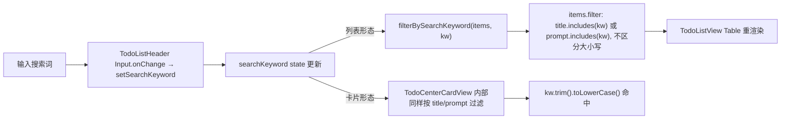
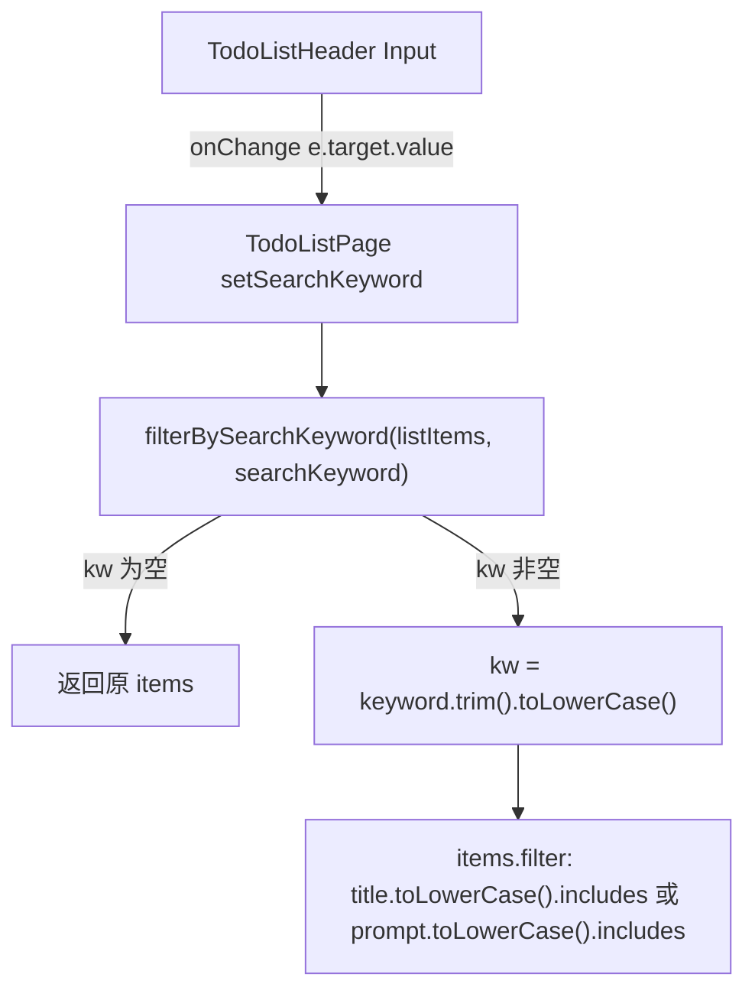
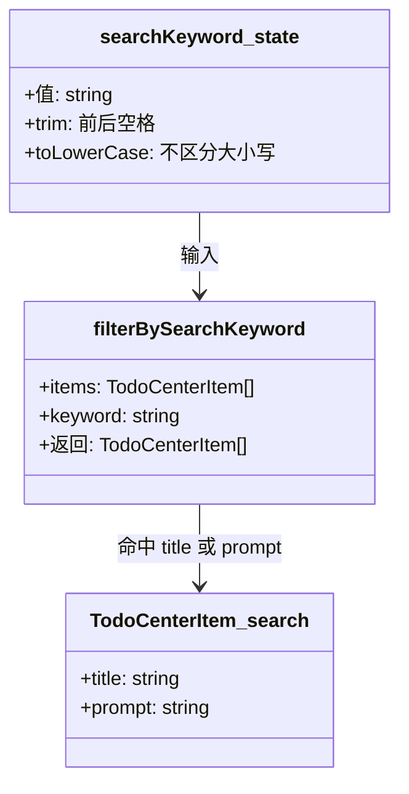
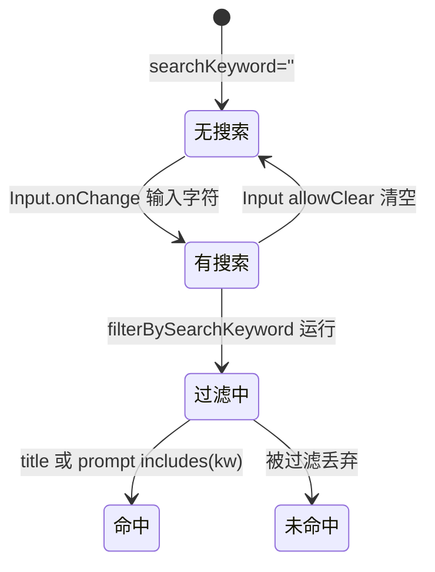

# 搜索过滤

## 功能位置

事项列表页 → 顶部 header 的 `Input`（`SearchOutlined` 前缀，`placeholder="搜索标题或 Prompt"`，`data-testid="items-page-search"`，桌面端可见；移动端精简隐藏）。

## 数据流图（前端 → 后端）

## 调用关系链路图

## 数据结构图

## 数据变更图

## 开发指导

- **前端入口**：`frontend/src/components/todo-list/TodoListPage.tsx` 的 `filterBySearchKeyword`（L44-52）与 `TodoListPage` 主函数（`searchKeyword` state + `listItems` 派生）；渲染在 `frontend/src/components/todo-list/TodoListPageParts.tsx` 的 `TodoListHeader`（Input，桌面端）。
- **后端入口**：无。搜索为纯前端二次过滤，不调后端。后端 `get_todo_center` 的 `search` 查询参数由 `TodoCenterCardView` 内部使用（卡片形态走后端过滤），列表形态走前端过滤。
- **注意**：搜索词统一大小写不敏感（`toLowerCase()` 后 `includes`）；空词返回全部。卡片/列表两种形态共用同一个 `searchKeyword` state，透传给 `TodoCenterCardView`（后端 search）和 `TodoListView`（前端 filter）。移动端精简 header 不渲染搜索框。
- **扩展**：若需按 `tag_ids` 或 `executor` 过滤，在 `filterBySearchKeyword` 增判断分支；若改走后端搜索，把 `searchKeyword` 透传给 `db.getTodoCenter` 的 `search` 参数即可（后端已按 title/prompt 子串匹配）。
