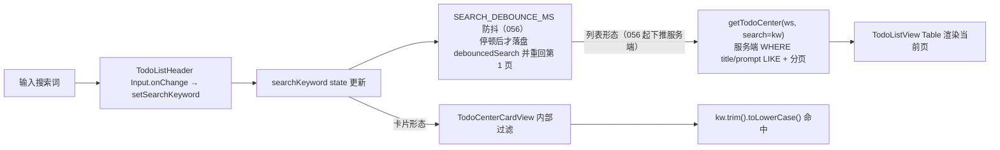
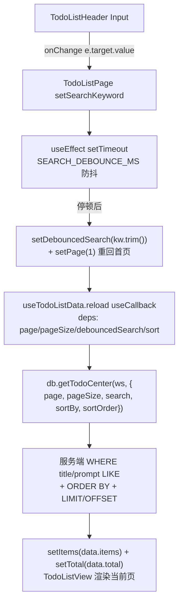
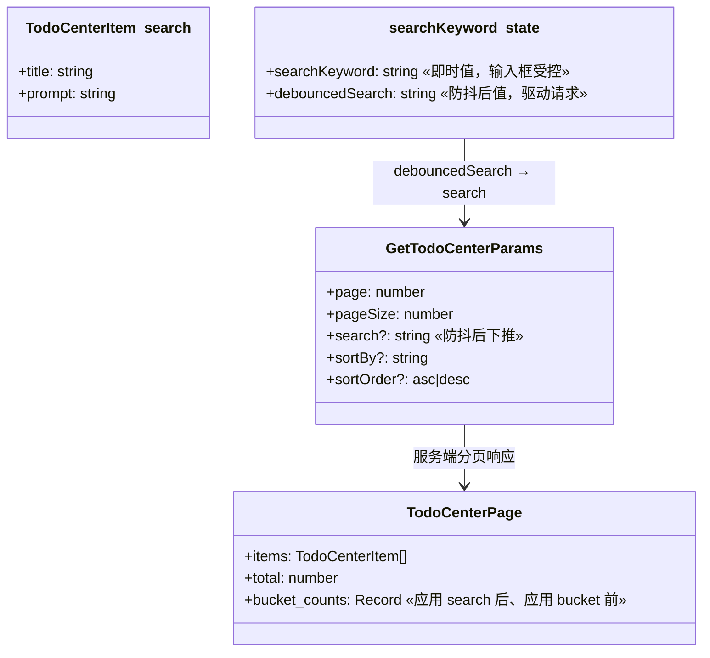
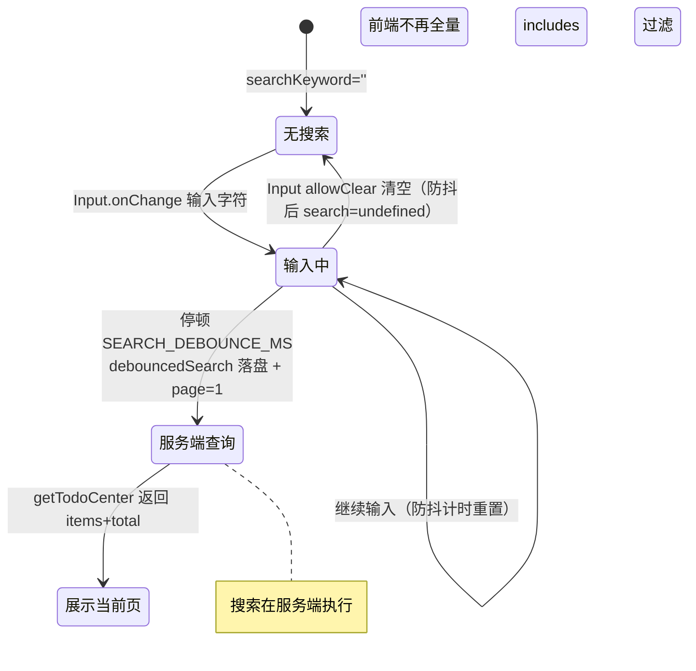

# 搜索过滤

## 功能位置

事项列表页 → 顶部 header 的 `Input`（`SearchOutlined` 前缀，`placeholder="搜索标题或 Prompt"`，`data-testid="items-page-search"`，桌面端可见；移动端精简隐藏）。

## 数据流图（前端 → 后端）

## 调用关系链路图

## 数据结构图

## 数据变更图

## 开发指导

- **前端入口**：`frontend/src/components/todo-list/TodoListPage.tsx` 的 `useTodoListData`——`searchKeyword` 即时值供输入框受控，`debouncedSearch` 经 `SEARCH_DEBOUNCE_MS` 防抖后作为 `search` 参数调 `db.getTodoCenter`，同时 `setPage(1)` 重回第 1 页（新搜索结果从首页看起）；渲染输入框在 `TodoListPageParts.tsx` 的 `TodoListHeader`（桌面端）。
- **后端入口**：`GET /api/v1/workspaces/{ws}/todos/center` 的 `search` 查询参数（`handlers/todo.rs::get_todo_center_v1` → `db/todo.rs::get_todo_center`），按 title/prompt 子串匹配；056 起列表形态与卡片形态都走该参数，无前端过滤残留。
- **注意**：防抖期间输入框即时回显但不发请求；防抖落盘即重回第 1 页，避免停在高页码看不到新结果；`bucket_counts`（五类驱动计数）是应用 search 之后、应用 bucket 之前统计的，搜索会同步收窄各分类计数。移动端精简 header 不渲染搜索框。
- **扩展**：新增筛选维度（如 tag/executor）时在 `getTodoCenter` 参数与后端查询条件同步加字段，并接入 `useTodoListData` 的 reload 依赖；改防抖时长调 `SEARCH_DEBOUNCE_MS` 常量。
