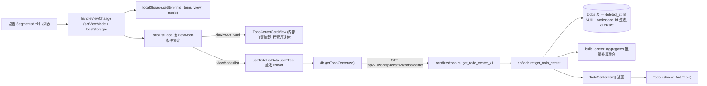
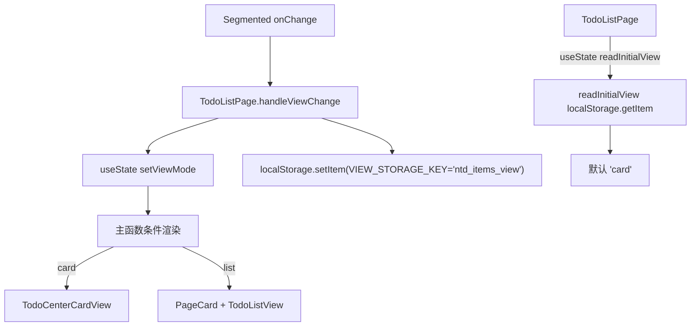
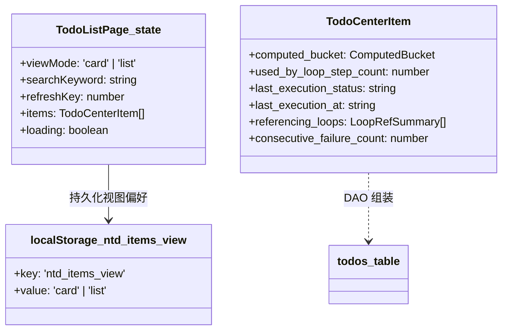
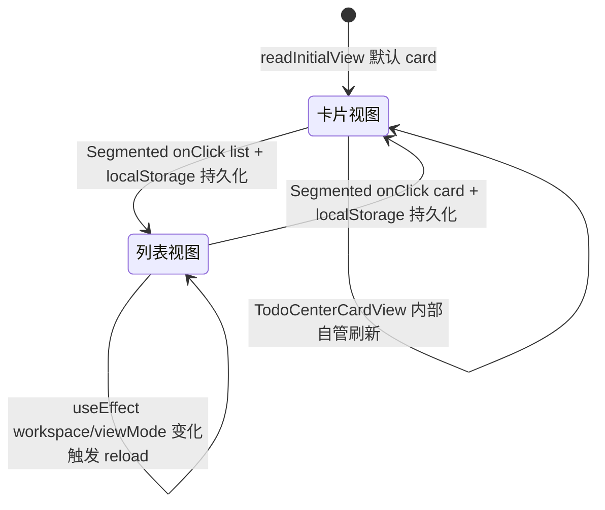

# 卡片/列表视图切换

## 功能位置

事项列表页 → 顶部 header 的 `Segmented`（`AppstoreOutlined` 卡片 / `UnorderedListOutlined` 列表，`data-testid="todo-center-view-toggle"`）。

## 数据流图（前端 → 后端）

## 调用关系链路图

## 数据结构图

## 数据变更图

## 开发指导

- **前端入口**：`frontend/src/components/todo-list/TodoListPage.tsx` 的 `TodoListPage`（`viewMode` state + `handleViewChange`）与 `frontend/src/components/todo-list/TodoListPageParts.tsx` 的 `TodoListHeader`（`Segmented` 渲染）。
- **后端入口**：`backend/src/handlers/todo.rs::get_todo_center_v1`（L676），DAO 在 `backend/src/db/todo.rs::get_todo_center`（L203）。
- **注意**：列表形态才会在 `useTodoListData` 的 useEffect 中拉数据；卡片形态不触发该 effect，由 `TodoCenterCardView` 内部自管加载与 `TODO_LIST_REFRESH_EVENT` 监听。视图偏好持久化在 `localStorage` 的 `ntd_items_view` 键，读时异常静默降级为默认 `card`。
- **扩展**：新增第三种视图（如「看板」）时，在 `viewMode` 联合类型加值 → `TodoListHeader` 的 `Segmented.options` 增项 → `TodoListPage` 主函数加条件渲染分支 → `readInitialView` 增值映射。
