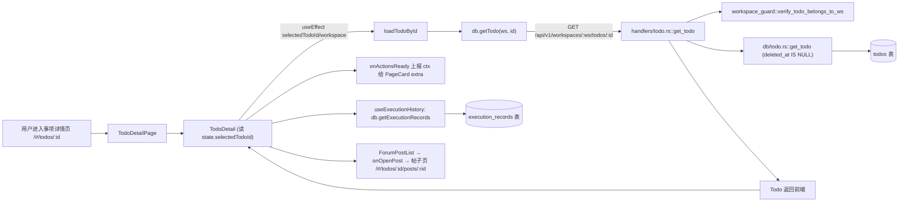

# 事项（详情）

> 页面级总览。本页各功能点的 4 图 + 开发指导在子文档中维护。

## 页面简介

事项详情独立页（URL `/#/todos/:id`，组件 `TodoDetailPage`）是事项命名空间的详情态入口。外层 `PageCard` 提供标题行（动态事项标题 + 「返回列表」按钮）与右上角操作按钮组（优化标题/编辑/删除）。内层复用 `TodoDetail` 组件承担详情逻辑：按 `selectedTodoId` 主动请求 `db.getTodo` 获取事项（不读列表缓存，保证 URL 直达时数据最新），渲染 `DetailHeader`（标题/prompt/执行器/执行按钮）、`ReferencingLoopsSection`（所属环路溯源）、`ForumPostList`（按 session 分组的执行历史，点击进入帖子页）。操作按钮上下文由 `TodoDetail` 通过 `onActionsReady` 回调上报给外层渲染，避免 `hideTitleRow=true` 时按钮连带标题一起消失。加载中显示骨架屏，加载失败显示空态 + 重试按钮。

## 页面级数据流总图

