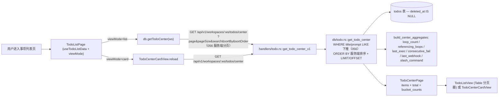

# 事项（列表）

> 页面级总览。本页各功能点的 4 图 + 开发指导在子文档中维护。

## 页面简介

事项列表页（URL `/#/todos`，组件 `TodoListPage`）是事项命名空间的列表态入口。它承担两类形态的切换与数据呈现：默认「卡片视图」渲染 `TodoCenterCardView`（按 `computed_bucket` 五类驱动分墙展示聚合卡片），用户切到「列表视图」后渲染 `PageCard + TodoListView`（Ant Design Table 单栏宽屏）。顶部 header 统一提供搜索框、刷新按钮、卡片/列表形态 `Segmented`、新建按钮。

056 起列表形态为**服务端分页**：`useTodoListData` 以 `{ page, pageSize, search, sortBy, sortOrder }` 调 `db.getTodoCenter`，搜索词防抖（`SEARCH_DEBOUNCE_MS`）后下推服务端并重回第 1 页，不再前端全量过滤；分页/排序参数变化即重拉当前页。卡片形态由 `TodoCenterCardView` 内部自管加载（同走 center 接口），两种形态共用同一搜索词。跨组件刷新通过 `TODO_LIST_REFRESH_EVENT` custom event 触发（TodoDrawer 保存、QuickCapture 创建后派发）。单行操作（删除/执行/带参执行）由 `useTodoRowActions` hook 提供，避免主函数膨胀。

## 页面级数据流总图

