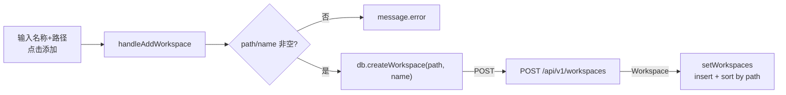
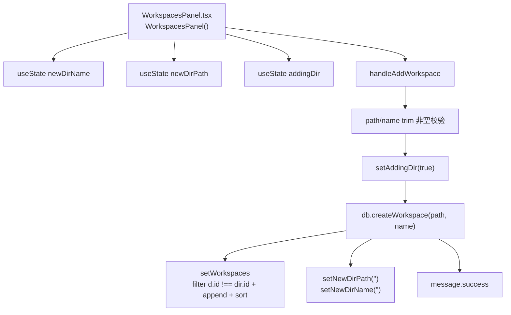
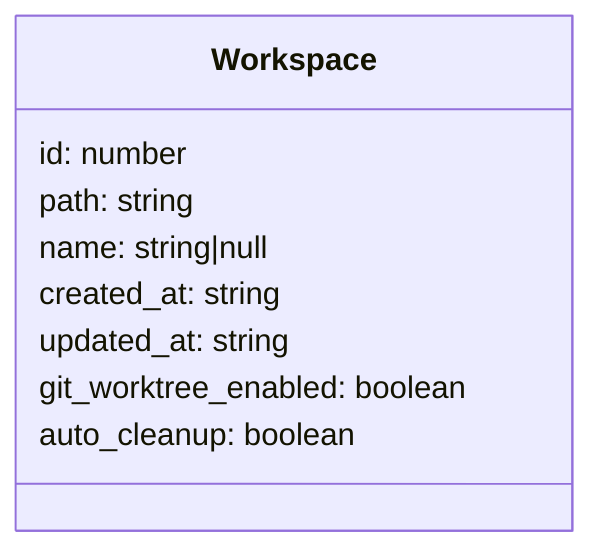
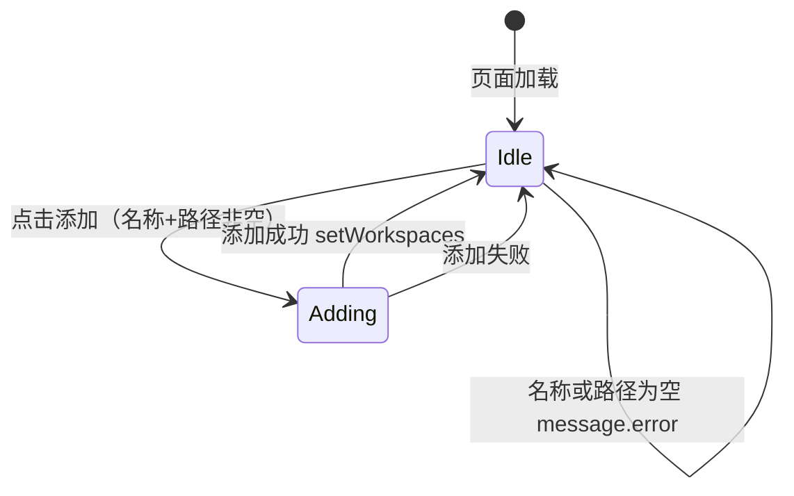

# 新建工作空间

## 功能位置
工作空间页 →「新建工作空间」Card → 名称 `Input` + 路径 `Input` +「添加」按钮（`PlusOutlined`）

## 数据流图（前端 → 后端）

## 调用关系链路图

## 数据结构图

## 数据变更图

## 开发指导
- **前端入口**：`frontend/src/components/settings/WorkspacesPanel.tsx` 的 `handleAddWorkspace` 回调；`Input onPressEnter` 也绑定此函数
- **后端入口**：`backend/src/handlers/workspace.rs` 处理 `POST /api/v1/workspaces`，要求 `path` 和 `name` 必填
- **注意**：新建时不传 `gitWorktreeEnabled` / `autoCleanup`（后端 create 不消费这些字段），策略需在创建后通过 update 设置；插入后按 `path.localeCompare` 排序保持列表稳定
- **扩展**：如需新建时同步设策略，后端 create handler 需接收并写入 `git_worktree_enabled` / `auto_cleanup`，前端 `createWorkspace` 恢复 options 参数
