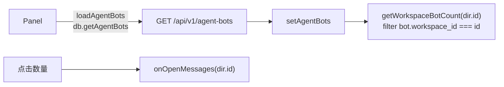
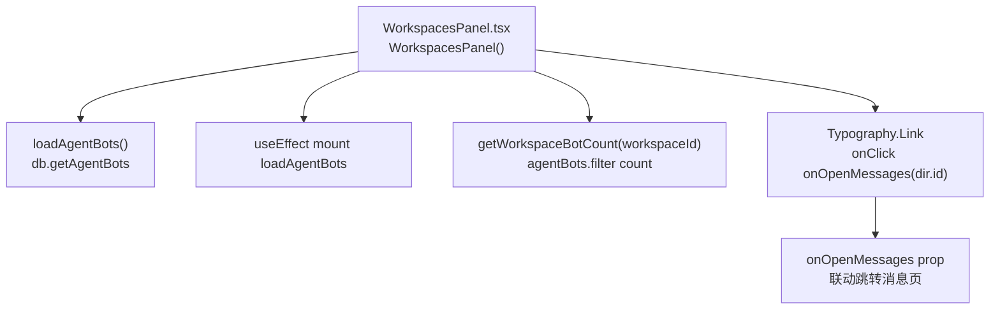
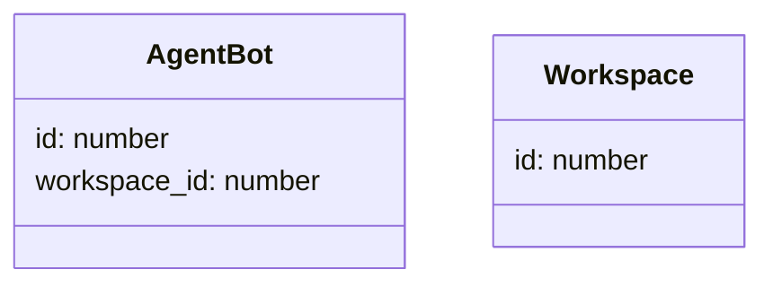
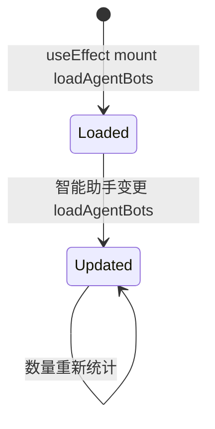

# 已绑定智能助手数量

## 功能位置
工作空间页 → 工作空间卡名称右侧 `Typography.Link`（`RobotOutlined` + 数量）

## 数据流图（前端 → 后端）

## 调用关系链路图

## 数据结构图

## 数据变更图

## 开发指导
- **前端入口**：`frontend/src/components/settings/WorkspacesPanel.tsx` 的 `loadAgentBots` / `getWorkspaceBotCount` 函数；`onOpenMessages` 由 props 传入
- **后端入口**：`backend/src/handlers/agent_bot.rs` 处理 `GET /api/v1/agent-bots`
- **注意**：`onOpenMessages?.(dir.id)` 是可选 prop，未传入时点击无效果；联动跳转交由父层切视图到 messages 并切 workspace 到该 id
- **扩展**：如需在工作空间卡上展示更多绑定信息（如活跃推送数），扩展 `getWorkspaceBotCount` 的过滤维度或拉取额外数据
