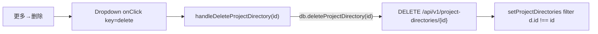
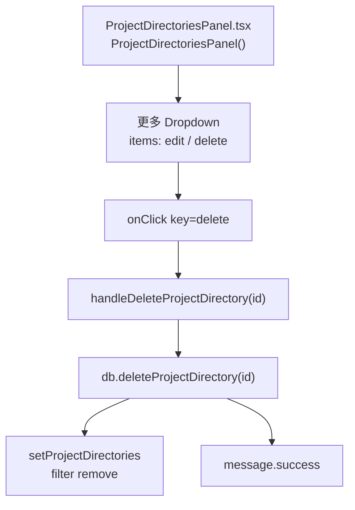
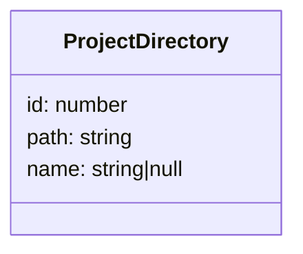
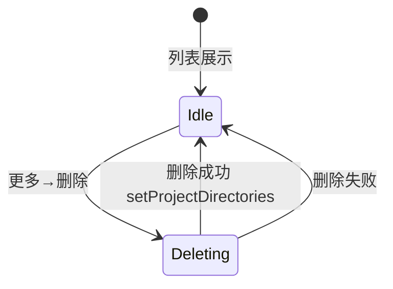

# 删除工作空间

## 功能位置
工作空间页 → 工作空间卡右侧「更多」`Dropdown` →「删除」（danger）

## 数据流图（前端 → 后端）

## 调用关系链路图

## 数据结构图

## 数据变更图

## 开发指导
- **前端入口**：`frontend/src/components/settings/ProjectDirectoriesPanel.tsx` 的 `handleDeleteProjectDirectory` 回调，由 `Dropdown onClick` key 分发触发
- **后端入口**：`backend/src/handlers/project_directory.rs` 处理 `DELETE /api/v1/project-directories/{id}`
- **注意**：删除无二次确认（直接执行），如需防误删可在前端加 `Popconfirm`；删除后 `filter` 移除对应卡片
- **扩展**：如需删除前检查是否仍有 Todo/智能助手绑定，后端 delete handler 追加前置校验并返回 409
