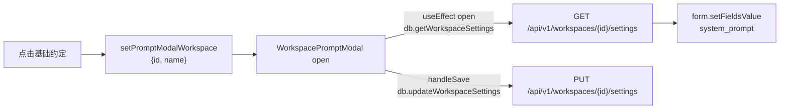
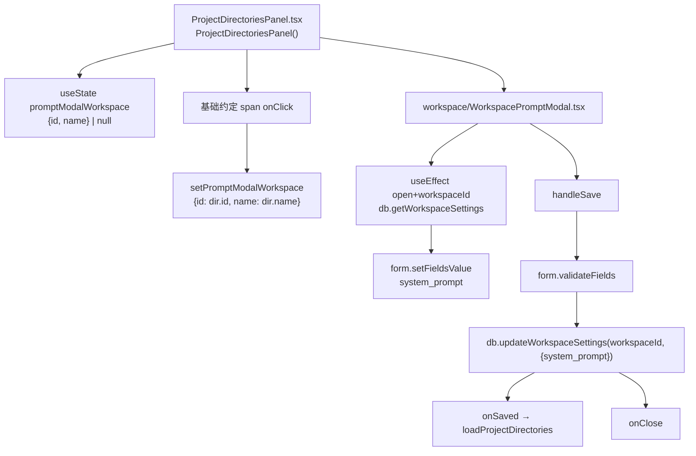
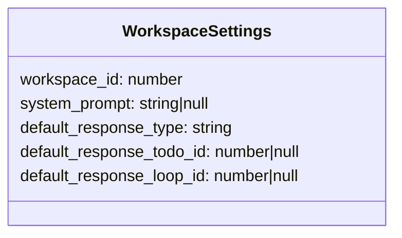
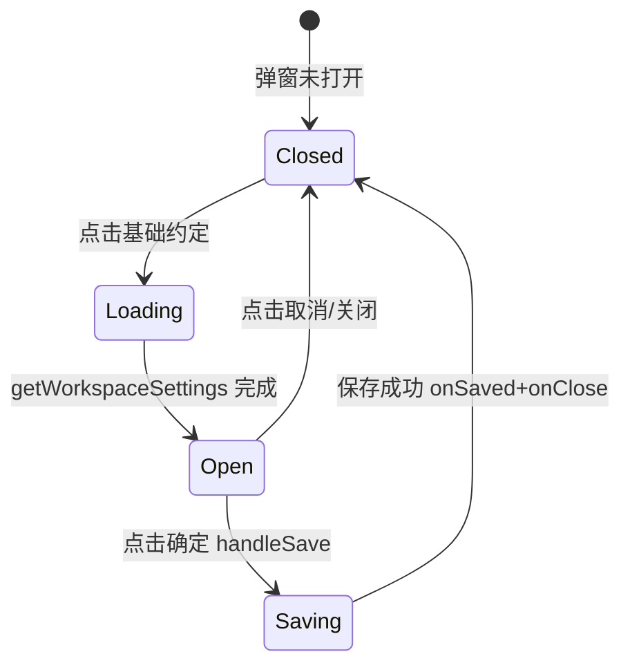

# 基础约定弹窗

## 功能位置
工作空间页 → 工作空间卡底部署理区 →「基础约定」可点击文本（`FileTextOutlined`）

## 数据流图（前端 → 后端）

## 谑用关系链路图

## 数据结构图

## 数据变更图

## 开发指导
- **前端入口**：`frontend/src/components/settings/workspace/WorkspacePromptModal.tsx` 的 `WorkspacePromptModal` 组件；由 `ProjectDirectoriesPanel` 的 `promptModalWorkspace` state 驱动 `open`
- **后端入口**：`backend/src/handlers/` 对应 workspace settings handler 处理 `GET /api/v1/workspaces/{id}/settings`、`PUT /api/v1/workspaces/{id}/settings`
- **注意**：`system_prompt` 为 null 时视作空串显示；空串表示显式清空，不是「不保存」；内容会作为执行器前置 prompt 注入到该工作空间下所有 todo 的执行中
- **扩展**：如需为工作空间追加更多设置字段（如默认执行器），`WorkspaceSettings` 类型扩展并在弹窗中追加 Form.Item
