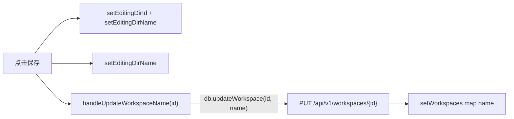
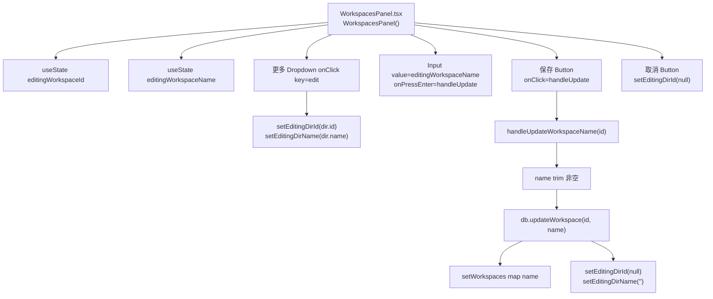
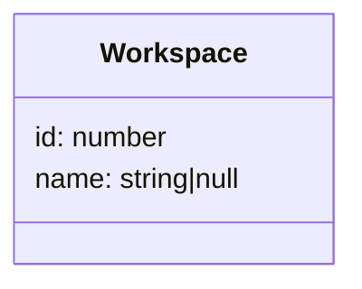
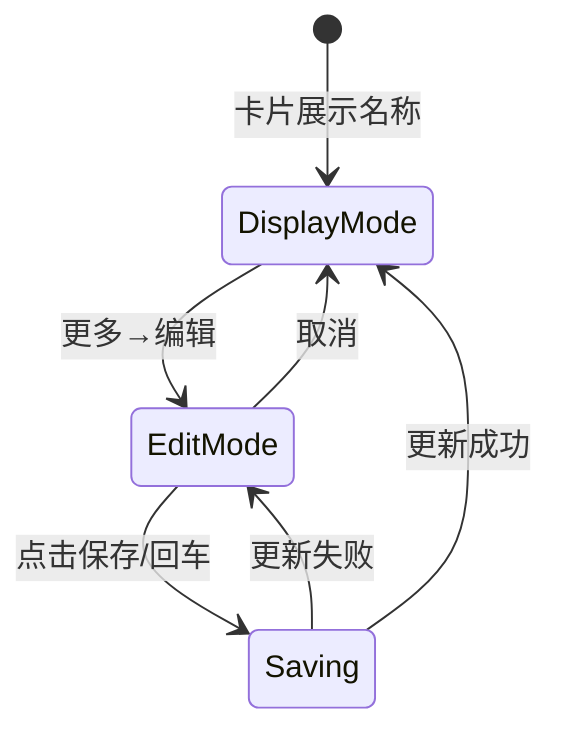

# 编辑工作空间名称

## 功能位置
工作空间页 → 工作空间卡右侧「更多」`Dropdown` →「编辑」→ 名称 `Input` + 「保存」按钮

## 数据流图（前端 → 后端）

## 谑用关系链路图

## 数据结构图

## 数据变更图

## 开发指导
- **前端入口**：`frontend/src/components/settings/WorkspacesPanel.tsx` 的 `handleUpdateWorkspaceName` 回调
- **后端入口**：`backend/src/handlers/workspace.rs` 处理 `PUT /api/v1/workspaces/{id}`，`name` 必填
- **注意**：`updateWorkspace` 的 `name` 是必传字段，即使只想改 worktree 开关也需带上当前 `name`；后端 handler 区分 `None`/`Some` 语义，前端用 `hasOwnProperty` 表达「故意不传」
- **扩展**：如需编辑其他字段（如 `path`），后端 update handler 的 body 追加可选字段，前端编辑模式追加对应 Input
