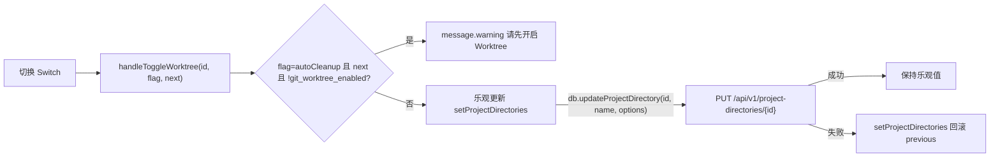
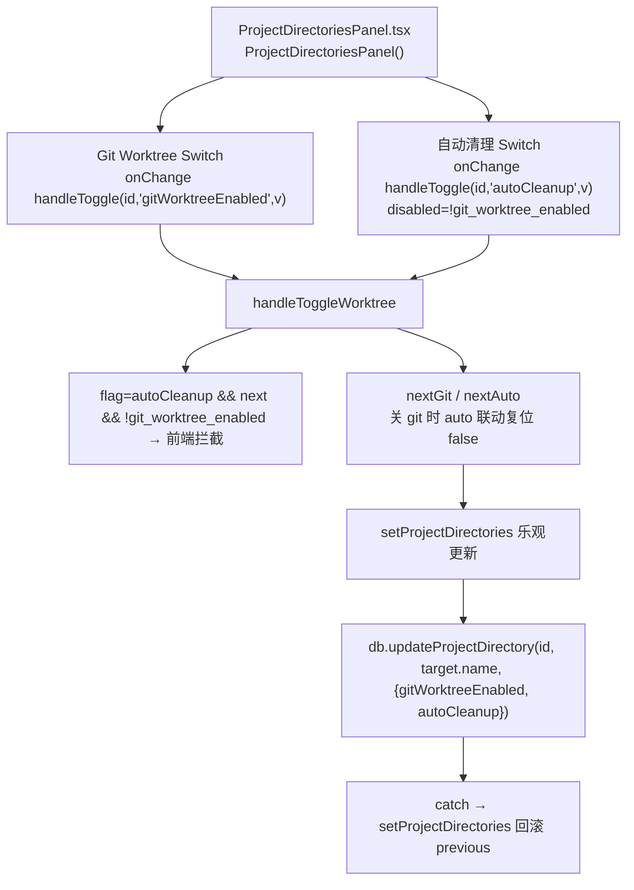
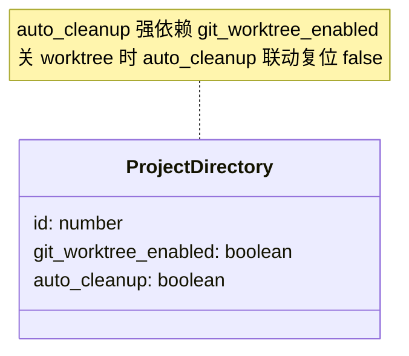
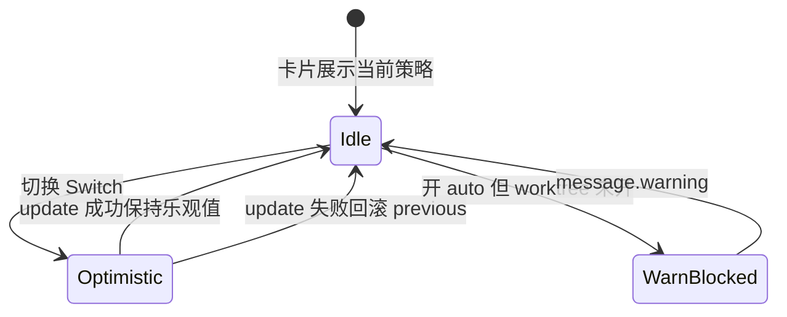

# Git Worktree / 自动清理开关切换

## 功能位置
工作空间页 → 工作空间卡底部署理区 →「Git Worktree」`Switch` /「自动清理」`Switch`

## 数据流图（前端 → 后端）

## 调用关系链路图

## 数据结构图

## 数据变更图

## 开发指导
- **前端入口**：`frontend/src/components/settings/ProjectDirectoriesPanel.tsx` 的 `handleToggleWorktree` 回调（`flag` 参数为 `'gitWorktreeEnabled'` 或 `'autoCleanup'`）
- **后端入口**：`backend/src/handlers/project_directory.rs` 处理 `PUT /api/v1/project-directories/{id}`，body 含 `git_worktree_enabled` / `auto_cleanup` 可选字段
- **注意**：前端先拦一道「开 auto 但关 worktree」的废组合避免无谓 HTTP；`auto_cleanup` 在 `git_worktree_enabled` 关闭时联动复位为 `false`；乐观更新失败需回滚 `previous`
- **扩展**：新增工作空间级策略开关时后端 schema migration + handler body 追加字段，前端 `handleToggleWorktree` 的 `flag` union 扩展并加乐观更新逻辑
